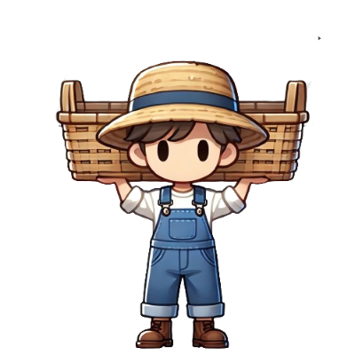
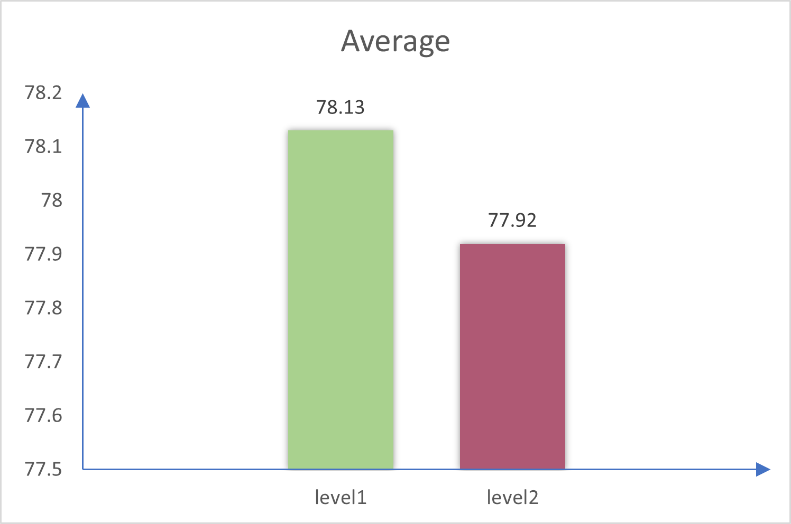

# 2025-group-30
2025 COMSM0166 group 30

## Your Game

Link to your game [PLAY HERE](https://uob-comsm0166.github.io/2025-group-30/) 

Your game lives in the [docs](/docs) folder, and is published using Github pages to the link above.

Include a demo video of your game here (you don't have to wait until the end, you can insert a work in progress video)
[🎬 Click here to watch the demo video](https://github.com/UoB-COMSM0166/2025-group-30/blob/nemo/videos/demo%20video.MP4)

## Table of Contents

## Development Team

  

| Name | Email | GitHub username |
|------------|------------------------------------|----------------|
| Lingchen Li | [yf24777@bristol.ac.uk](mailto:yf24777@bristol.ac.uk) | lingchen2333 |
| Lei Gao | [yt24392@bristol.ac.uk](mailto:yt24392@bristol.ac.uk) | Muilka |
| Hanying Bian | [oo24343@bristol.ac.uk](mailto:oo24343@bristol.ac.uk) | Hanying-Bian |
| Shiyu Dou | [hl24597@bristol.ac.uk](mailto:hl24597@bristol.ac.uk) | hl24597 |
| Zhuoyan Qiu | [rp24358@bristol.ac.uk](mailto:rp24358@bristol.ac.uk) | 1003-qzy |
| Liyang Li | [gq24742@bristol.ac.uk](mailto:gq24742@bristol.ac.uk) | Misaki-1 |

## Project Report

### Introduction

Our game is a casual stacking challenge inspired by a classic mini-game from the popular title *Mole Manor*. Drawing from its gameplay, we set the game’s backdrop during the harvest season on a farm. Players must control their character’s left and right movements to catch falling haystacks and place them into a basket within a limited time in order to reach the collection goal and advance to the next level.

To increase the game’s difficulty and reflect real-world limitations on how much a person can carry, each player can catch a maximum of five haystacks at a time. If this limit is exceeded, the character will stumble and drop all collected hay. This mechanic not only adds tension but also introduces strategic decision-making—players must carefully balance between collecting more hay and emptying their basket in time.

As hay accumulates, the character’s movement speed gradually slows down, requiring players to choose the right moment to clear their collection bucket and maintain agility. Building on the original gameplay, the game introduces more challenging elements: in single-player mode, players must dodge falling shovels and buckets while collecting stars for extra lives. In two-player mode, players can either collaborate to achieve a shared goal or compete to see who finishes first. These design features enrich the gameplay and deliver a fun, fast-paced, yet relaxing farm harvest experience.

The following table shows the main elements of the game:
#### Table 1: Game Elements
| Category  | Image  | Description  |
|-----------|--------|--------------|
| **Player & lifting basket** |  | The character controlled by the player, moving left and right to catch falling hay. |
| **collection Basket** |  | A secondary basket used for catching hay before transferring it to the main collection basket. |
| **Falling Hay** |  | The hay stacks that fall from the sky. Players must catch them efficiently to reach the target before time runs out. |

- 5% ~250 words 
- Describe your game, what is based on, what makes it novel? 

### Requirements 
- 15% ~750 words
- Use case diagrams, user stories. Early stages design. Ideation process. How did you decide as a team what to develop? 

#### Inspiration

In the first week of our game project, we held a team meeting to discuss various game ideas based on our understanding of different game concepts. We evaluated each idea based on familiarity, innovation, and feasibility, ultimately brainstorming five potential game concepts. After thorough discussion, we conducted a vote, and the Grass Catching Game emerged as the final winner.

The inspiration for our grass-catching game comes from Mole's World. Unlike the grass-catching mechanics in Mole's World, where the grass follows a parabolic trajectory, our game adopts a vertical free-fall motion, emphasizing players' reaction speed and precise judgment. Additionally, the grass may have different falling speeds and shapes, allowing for difficulty adjustments that present players with more challenging grass-catching tasks.

#### Prototype

During the conceptualization of the grass-catching game, we created a paper prototype to help visualize and test early game mechanics, including the way the grass falls, as well as the player's movement and interactions. Based on our initial discussions, we refined the game flow and mechanics, adding new elements to enhance the game's fun and challenge. To provide players with a clearer understanding of the game, we created a video based on the paper prototype, offering an intuitive demonstration of the gameplay.

  <strong>Paper Prototype of Grass-Catching Game</strong>

  <video src="https://github.com/user-attachments/assets/2bc9ad40-728b-4c61-b258-6c2530942f93" controls width="600"></video>

#### Digital Paper Prototype tool

To help players quickly get familiar with the game, we created a digital model based on the paper prototype. Hanying attempted to generate the digital model using her iPad, which allowed for a representation that more closely resembled the actual game compared to the paper prototype.

<b>Digital·Paper·Prototype·Tool</b>

  

<b>Failed</b>

  

**Project overview**

The project aims to develop a simple 2D mini-game where players stack square grass blocks.
Initially, we considered using different shapes for stacking as the core gameplay mechanism and planned to integrate an external physics engine for realistic physics simulation. 
However, after preliminary research and technical assessment, we found that our current skill level poses certain limitations in implementing this approach. Therefore, we reassessed the feasibility.
Eventually, we decided to remove the physics engine and use a simple square grass block stacking mechanism to reduce technical complexity.

**Requirement Analysis**

#### 1. User Requirements
- Players should be able to control and stack square grass blocks smoothly

#### 2. Technical Requirements
- Client-side Development: Implement the game interface and handle user input
- Physics Simulation: Remove the external physics engine and use a simple square block stacking mechanism

#### Technical Feasibility Study

##### Initial Plan
- Use an external physics engine (e.g., Box2D, Matter.js) for simulating different shape interactions
- Requires complex physics calculations, including collision detection and gravity simulation

##### Feasibility Evaluation
- Lack of experience in physics engine development makes debugging and optimization challenging
- Complex physics calculations may lead to high computational resource consumption, affecting game performance

##### Alternative Plan
- Switch to simple square grass block stacking without relying on an external physics engine
- Use a rule-based stacking method where each block is placed according to predefined logic
- Implement basic rectangle overlap detection for collision handling to improve development efficiency

Based on the feasibility analysis, we have decided to adjust the game design by abandoning the complex physics engine integration and opting for a simple square grass block stacking mechanism. This will reduce technical difficulty, improve development efficiency, and ensure game stability.

### Stakeholders Analysis 

<strong>Onion Model</strong>

  

#### Core Layer: Group 30
Group 30-2025 are the core creators of the game, responsible for its design, development, and implementation. They determine the quality, gameplay, and overall experience of the game.

#### Internal Layer: Players and Lecturers
- **Players**: The end-users of the game, including:
  - New Players
  - Old Players
  - Casual Players
  - Competitive Players
- **Lecturers**: The evaluators of the assignment, responsible for assessing the quality of the game and whether it meets course requirements

#### Competition Layer: Other Teams
Other teams are competitors in the assignment, and their performance may influence the evaluation by lecturers and bystanders.

#### External Layer: Broader Audience
Bystanders are potential users who may not directly participate in the game but could be attracted to become new players.

<strong>Use Case Diagram</strong>

  

#### 1. Players
Players are the primary users of the game, interacting with the game system to achieve objectives.

Main Use Cases:
- Choose game mode: Select between single-player or multi-player mode
- Play game: Control character movement, catch grass, and drop grass into the basket
- Pause game: Pause the current game

#### 2. Developers
Developers are responsible for maintaining and updating the game to ensure it runs smoothly.

Main Use Cases:
- Debug game: Fix errors in the game
- Update game: Add new features or optimize existing ones
- Test game: Test the game to ensure stability
- Monitor game: Monitor the game's performance to identify potential issues

#### 3. Game System
Game system manages the core logic and state of the game.

Main Functions:
- Update score: Update the score when players drop grass into the basket
- Decrease lives: Reduce lives when players fail
- Level up: Increase game difficulty when players reach a certain score
- Game over: End the game when lives reach zero

#### User Stories and Epics

<table>
<tr>
  <th style="width: 12%;">User Type</th>
  <th style="width: 15%;">Epic</th>
  <th style="width: 35%;">User Story</th>
  <th style="width: 38%;">Acceptance Criteria</th>
</tr>

<tr>
  <td>Casual Player</td>
  <td>Beginner-Friendly Experience</td>
  <td>As a casual player, I want the game controls to be simple and intuitive so that I can quickly learn and enjoy the game.</td>
  <td>Given I am playing the game, when I use the controls, then they should be minimal and easy to understand.</td>
</tr>
<tr>
  <td></td>
  <td></td>
  <td>As a casual player, I want a clear tutorial when I first enter the game so that I can quickly learn how to play.</td>
  <td>Given it is my first time entering the game, when I start playing, then a tutorial should appear explaining the basic controls and rules.</td>
</tr>
<tr>
  <td></td>
  <td></td>
  <td>As a casual player, I want a pause and resume function so that I can play at my own pace.</td>
  <td>Given I am in a game session, when I click the pause button, then I should be presented with options to pause, resume, or restart.</td>
</tr>
<tr>
  <td></td>
  <td>Replayability</td>
  <td>As a casual player, I want to replay levels to improve my skills and gain a sense of achievement.</td>
  <td>Given I complete a level, when I choose to replay, then I should be able to restart the same level without restrictions.</td>
</tr>
<tr>
  <td>Hardcore Player</td>
  <td>Character Progression</td>
  <td>As a hardcore player, I want to upgrade my character’s equipment so that I can compete at higher difficulty levels.</td>
  <td>Given I have in-game currency or rewards, when I visit the store, then I should be able to buy gear to enhance my character.</td>
</tr>
<tr>
  <td></td>
  <td>Ranking System</td>
  <td>As a hardcore player, I want to see global rankings so that I can compete with other players for high scores.</td>
  <td>Given I am on the main menu, when I open the leaderboard, then I should see the top 10 players’ scores.</td>
</tr>
<tr>
  <td></td>
  <td></td>
  <td>As a hardcore player, I want to compare scores with my friends so that I can compete with them.</td>
  <td>Given I have friends added in-game, when I view the friends leaderboard, then I should see their scores to compare with mine.</td>
</tr>
<tr>
  <td></td>
  <td>Game Challenge</td>
  <td>As a hardcore player, I want the game to become more challenging over time so that it remains engaging.</td>
  <td>Given the game progresses, when I reach higher levels, then the game should introduce faster speeds or new obstacles.</td>
</tr>
<tr>
  <td>Social Player</td>
  <td>Multiplayer Mode</td>
  <td>As a social player, I want to compete or cooperate with my friends so that we can play together.</td>
  <td>Given I enter multiplayer mode, when I choose competitive or co-op, then the game should support both modes and show rankings after matches.</td>
</tr>
<tr>
  <td>Creative Player</td>
  <td>Character Customization</td>
  <td>As a creative player, I want to customize my character so that I can personalize my gaming experience.</td>
  <td>Given I open the customization menu, when I select different options, then I should be able to save and use them in-game.</td>
</tr>
<tr>
  <td>Detail-Oriented Player</td>
  <td>Realistic Physics</td>
  <td>As a detail-oriented player, I want realistic physics for stacking objects and accurate sound effects when catching items.</td>
  <td>Given I am stacking hay or catching it, when physics interactions occur, then they should follow real-world rules and trigger appropriate sound effects.</td>
</tr>
</table>

  
### Design

- 15% ~750 words 
- System architecture. Class diagrams, behavioural diagrams. 

### Implementation

- 15% ~750 words

- Describe implementation of your game, in particular highlighting the three areas of challenge in developing your game. 

### Evaluation
To ensure a balance between functionality and usability during the game development process, we chose to combine both qualitative and quantitative evaluation methods. Qualitative analysis helped us identify issues within the game, while quantitative evaluation provided insights into user perceptions, guiding us to iteratively improve the design.
#### Qualitative Evaluation - Heuristic Evaluation
 For the qualitative method, we adopted Heuristic Evaluation, a practical and widely used approach that examines the interface based on Nielsen’s ten usability principles. By systematically reviewing each screen of our game, we identified several usability issues, including unclear navigation flow, inconsistent system feedback, limited user control, and lack of clarity in competitive scoring. Each issue was evaluated across three dimensions—Frequency, Impact, and Persistence—to calculate a severity score and prioritize the most critical problems.The results are shown in the following table:
#### Heuristic Evaluation Table
<table>
  <tr>
    <th style="width: 15%;">Interface</th>
    <th style="width: 35%;">Issue</th>
    <th style="width: 25%;">Heuristic(s)</th>
    <th style="width: 5%;">F (0-4)</th>
    <th style="width: 5%;">I (0-4)</th>
    <th style="width: 5%;">P (0-4)</th>
    <th style="width: 10%;">Severity</th>
  </tr>
  <tr>
    <td>Main Menu</td>
    <td>The extra "Start" button is unnecessary; players should select the mode first and then start.</td>
    <td>User control and freedom</td>
    <td>3</td>
    <td>3</td>
    <td>3</td>
    <td>3.00</td>
  </tr>
  <tr>
    <td>Mode Selection</td>
    <td>The single-player or multiplayer selection screen lacks a button to return to the main menu.</td>
    <td>User control and freedom</td>
    <td>3</td>
    <td>3</td>
    <td>4</td>
    <td>3.33</td>
  </tr>
  <tr>
    <td>Multiplayer End</td>
    <td>Missing score comparison prevents players from visually comparing their scores.</td>
    <td>Visibility of system status</td>
    <td>3</td>
    <td>3</td>
    <td>4</td>
    <td>3.33</td>
  </tr>
  <tr>
    <td>Multiplayer Gameplay</td>
    <td>The time display is only on the left side, making it difficult for the right-side player to see the remaining time.</td>
    <td>Visibility of system status</td>
    <td>4</td>
    <td>3</td>
    <td>4</td>
    <td>3.67</td>
  </tr>
  <tr>
    <td>Gameplay Speed</td>
    <td>The grass-cutting speed varies on different platforms, affecting the gaming experience.</td>
    <td>Error prevention</td>
    <td>4</td>
    <td>4</td>
    <td>4</td>
    <td>4.00</td>
  </tr>
  <tr>
    <td>Character Store</td>
    <td>The lack of a store system prevents players from selecting different characters or grass-cutting tools.</td>
    <td>Flexibility and efficiency of use</td>
    <td>3</td>
    <td>2</td>
    <td>3</td>
    <td>2.67</td>
  </tr>
  <tr>
    <td>Multiplayer Gameplay</td>
    <td>In multiplayer mode, the character/tool selection cannot meet the personalized needs of different players.</td>
    <td>Flexibility and efficiency of use</td>
    <td>3</td>
    <td>2</td>
    <td>3</td>
    <td>2.67</td>
  </tr>
</table>

Based on the severity scores in the evaluation table, we will prioritize addressing high-severity issues, such as speed inconsistency across platforms and insufficient time display in multiplayer mode.    next development focus will be on enhancing the user experience by improving UI feedback, adding return and help buttons, and introducing a store system for character/tool customization. Through these improvements, we aim to create a smoother, more intuitive, and more engaging gameplay experience.

#### SUS evaluation
We collected and analyzed SUS questionnaire data from 12 users for both Level 1 and Level 2, calculating their total SUS scores. We then used the Wilcoxon Signed-Rank Test to examine whether there was a statistically significant difference in usability scores between the two levels. Click [here](sus.md) to see the raw data.

  

  

The results of the Wilcoxon Signed-Rank Test for the System Usability Scale (SUS) scores show no statistically significant difference between the two difficulty levels (W = 10.5, p = 0.5461). Although individual user scores vary slightly, both the easy and hard levels received generally high SUS scores. This suggests that users found the game to be consistently usable across both difficulty settings.

- 15% ~750 words

- One qualitative evaluation (your choice) 
- One quantitative evaluation (of your choice) 
- Description of how code was tested. 

### Process 

- 15% ~750 words

- Teamwork. How did you work together, what tools did you use. Did you have team roles? Reflection on how you worked together. 

### Conclusion

- 10% ~500 words

- Reflect on project as a whole. Lessons learned. Reflect on challenges. Future work. 

### Contribution Statement

- Provide a table of everyone's contribution, which may be used to weight individual grades. We expect that the contribution will be split evenly across team-members in most cases. Let us know as soon as possible if there are any issues with teamwork as soon as they are apparent. 

### Additional Marks

You can delete this section in your own repo, it's just here for information. in addition to the marks above, we will be marking you on the following two points:

- **Quality** of report writing, presentation, use of figures and visual material (5%) 
  - Please write in a clear concise manner suitable for an interested layperson. Write as if this repo was publicly available.

- **Documentation** of code (5%)

  - Is your repo clearly organised? 
  - Is code well commented throughout?
