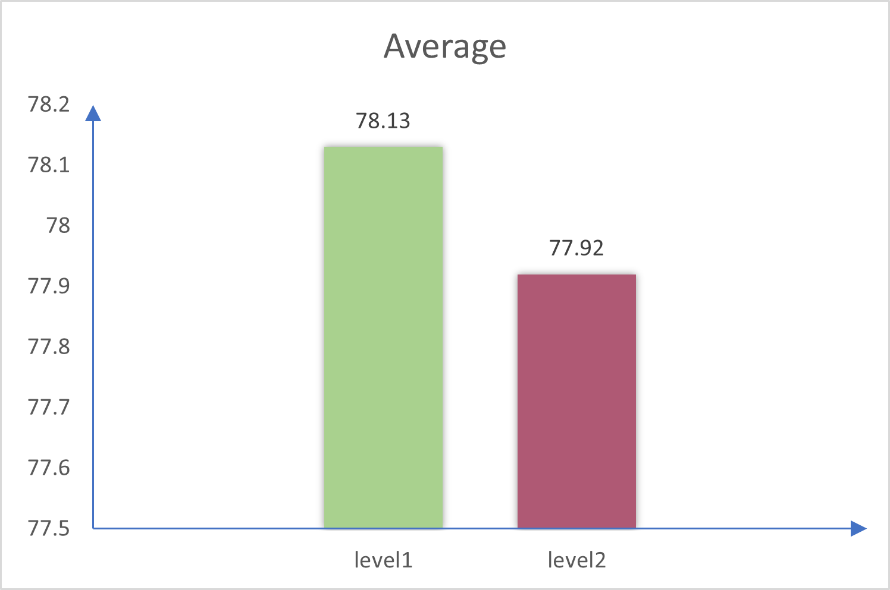
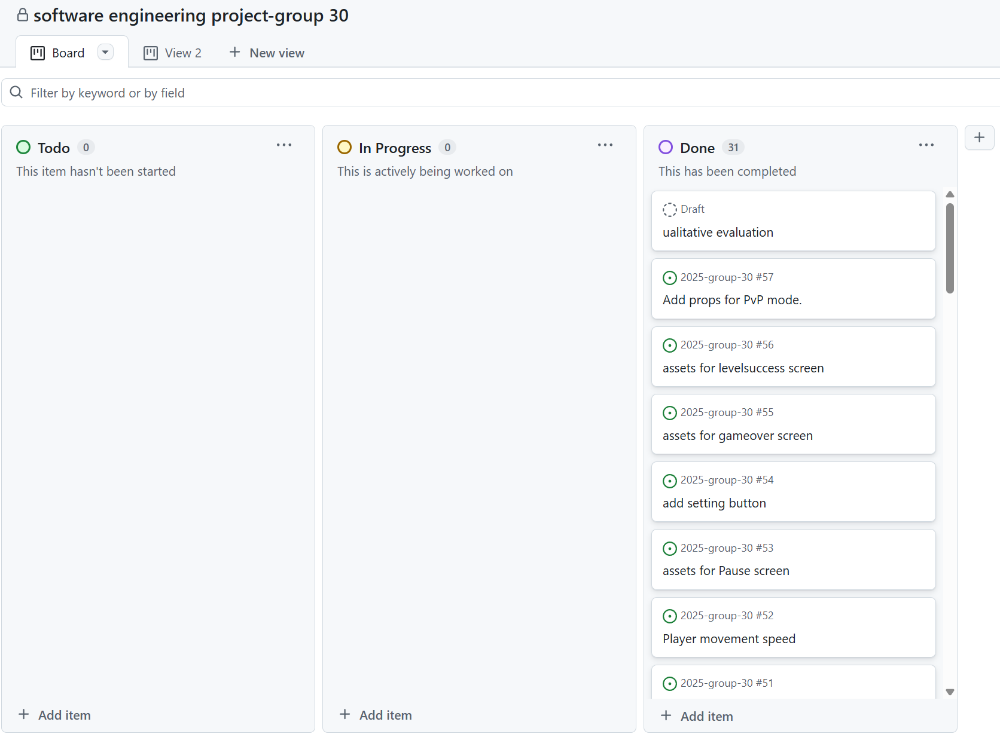

# 2025-group-30
2025 COMSM0166 group 30

# Table of Contents
- [1. Game & Game video](#1game--game-video)
- [2. Team](#2team)
- [3. Introduction](#3introduction)
- [4. Requirements](#4requirements)
- [5. Design](#5design)
- [6. Implementation](#6implementation)
- [7. Evaluation](#7evaluation)
- [8. Sustainability](#8sustainability)
- [9. Process](#9process)
- [10. Conclusion](#10conclusion)
- [11. Contribution Statement](#11contribution-statement)
- [12. Additional Marks](#12additional-marks)

# 1.Game & Game video

Link to your game [PLAY HERE](https://uob-comsm0166.github.io/2025-group-30/) 

Our game lives in the [docs](/docs) folder, and is published using Github pages to the link above.

Include a demo video of our game here
[🎬 Click here to watch the demo video](https://github.com/UoB-COMSM0166/2025-group-30/blob/nemo/videos/demo%20video.MP4)

# 2.Team

   <i> Figure 1: Group photo of the team</i> 
  

  

    <i>Table 1: Team members, from Left to Right of Figure 1</i>

| Name         | Email                                                 | GitHub username |
| ------------ | ----------------------------------------------------- | --------------- |
| Lingchen Li  | [yf24777@bristol.ac.uk](mailto:yf24777@bristol.ac.uk) | lingchen2333    |
| Hanying Bian | [oo24343@bristol.ac.uk](mailto:oo24343@bristol.ac.uk) | Hanying-Bian    |
| Liyang Li    | [gq24742@bristol.ac.uk](mailto:gq24742@bristol.ac.uk) | Misaki-1        |
| Lei Gao      | [yt24392@bristol.ac.uk](mailto:yt24392@bristol.ac.uk) | Muilka          |
| Shiyu Dou    | [hl24597@bristol.ac.uk](mailto:hl24597@bristol.ac.uk) | hl24597         |
| Zhuoyan Qiu  | [rp24358@bristol.ac.uk](mailto:rp24358@bristol.ac.uk) | 1003-qzy        |

# 3.Introduction
- 5% ~250 words 
- Describe your game, what is based on, what makes it novel? 

Our game is a casual stacking challenge inspired by a classic mini-game from the popular title *Mole Manor*. Drawing from its gameplay, we set the game's backdrop during the harvest season on a farm. Players must control their character's left and right movements to catch falling haystacks and place them into a basket within a limited time in order to reach the collection goal and advance to the next level.

To increase the game's difficulty and reflect real-world limitations on how much a person can carry, each player can catch a maximum of five haystacks at a time. If this limit is exceeded, the character will stumble and drop all collected hay. This mechanic not only adds tension but also introduces strategic decision-making—players must carefully balance between collecting more hay and emptying their basket in time.

As hay accumulates, the character's movement speed gradually slows down, requiring players to choose the right moment to clear their collection bucket and maintain agility. Building on the original gameplay, the game introduces more challenging elements: in single-player mode, players must dodge falling shovels and buckets while collecting stars for extra lives. In two-player mode, players can either collaborate to achieve a shared goal or compete to see who finishes first. These design features enrich the gameplay and deliver a fun, fast-paced, yet relaxing farm harvest experience.

The following table shows the main elements of the game:

    <i>Table 2: Game Elements</i>

| Category | Image | Description |
|:---      | :---: | :---:       |
| **Player & lifting basket** |         | The character controlled by the player, moving left and right to catch falling hay.                                        |
| **collection Basket**       |          | A secondary basket used for catching hay before transferring it to the main collection basket.                           |
| **Falling Hay**             |             | The hay stacks that fall from the sky. Players must catch them efficiently to reach the target before time runs out.       |
| **Shovel**                  |          | If the player accidentally comes into contact with a randomly dropped item—a shovel—it will cause the current stack of grass the player is holding to be cleared. However, this does not affect the number of grass bundles that have already been counted in the basket.                                                                                                            |
| **ProteinShaker**           |  | When used, this item temporarily increases the player's maximum stack limit to 10 (originally 5) for 10 seconds, and removes the movement speed penalty caused by stacking grass. A red particle effect is triggered during this period.                |
| **SpeedBoot**               |      | When used, this item increases the player's movement speed by 20% for 5 seconds and triggers a blue particle effect, granting the player enhanced mobility for a short duration.                                                                         |

# 4.Requirements 
- 15% ~750 words
- Use case diagrams, user stories. Early stages design. Ideation process. How did you decide as a team what to develop? 

## 4.1 Game Idea Brainstorming Overview

As part of our early ideation process, our team participated in a collaborative brainstorming session to generate and explore a variety of game concepts. We studied a wide range of existing games, focusing on their core mechanics, player engagement strategies, and potential for creative development. Our goal was to identify gameplay elements that are not only fun and challenging, but also flexible enough to allow for innovation and adaptation.

The table below summarizes our findings. For each game, we described its core concept and proposed potential extensions or twists to make the gameplay more unique, engaging, or suitable for different audiences and platforms.

    <i>Table 3: Original game ideas</i>

| Game Genre                     | Game Inspiration    | Game Description                                                                                                                                                                      | Creative Expansion Ideas                                                                                                                                                                                                  |
| ------------------------------ | ------------------- | ------------------------------------------------------------------------------------------------------------------------------------------------------------------------------------- | ------------------------------------------------------------------------------------------------------------------------------------------------------------------------------------------------------------------------- |
| Puzzle Game                    | Car Park Puzzle     | A logic-based game where players must move surrounding vehicles forward or backward to clear a path for their own car to exit the parking lot.                                        | - Dynamically generate car layouts based on difficulty   - Add cars facing different directions   - Bus station mode: match passengers with buses   - Real-world elements like crosswalks, truck unloading zones |
| Cooperative Puzzle Platformer  | Fireboy & Watergirl | Two players work together to navigate levels by controlling Fireboy and Watergirl, each immune to their respective element. Touching the wrong element or falling results in failure. | - New elements like electricity/ice/wind   - Attribute swapping mechanics   - Time-limited challenges and multiple endings   - Unlockable skills and collectibles                                                |
| Casual Reaction Game           | Flappy Bird         | Players tap to keep a bird in the air and avoid pipes. Each successful pass earns one point. The game restarts upon failure.                                                          | - Moving or rotating obstacles   - Power-up system: shields, speed boosts   - Multiplayer co-op or versus mode   - Timed bonus collection mode                                                                   |
| Multiplayer Cooperative Puzzle | Pico Park           | Players collect keys and open gates while navigating obstacles together. Movement is limited to up, down, left, and right. Supports 2–8 players.                                      | - Random events triggered by pressure plates   - Fog to limit visibility   - Assign unique skills to each player (fly, climb, lift)   - Add immersive story mode                                                 |
| Strategy + Reflex Mini Game    | Grass Catching      | Players catch falling grass. The more they collect, the slower they move, increasing challenge and requiring strategic movement and timing.                                           | - Cooperative or versus mode   - Special grass types (e.g. poison, explosive)   - Weather effects influencing falling patterns   - Speed boost or weight-reducing power-ups                                      |

## 4.2 Game Delection Process

As part of our game development planning, our team initially brainstormed and analyzed five different game inspirations. After careful discussion and evaluation, we shortlisted two candidates for prototyping:Fireboy & Watergirl and Grass Catching.

To better understand and experience the game mechanics, we created paper prototypes for both games. By interacting with the prototypes directly, we were able to simulate the core gameplay and interaction flow, design basic maps and character movement paths, observe players' intuitive understanding and reactions, and evaluate whether the gameplay was engaging and expandable.

The following are our paper prototypes for Fireboy & Watergirl and Grass Catching.

   <a href="https://youtu.be/uvnLMF2GfXI">Figure 2: Fireboy & Watergirl Game Prototype</a> 
  

   <a href="https://youtu.be/uvnLMF2GfXI">Figure 3: Haystacking Game Prototype</a> 
  

## 4.3 Final Decision
After multiple rounds of testing and team feedback, we ultimately selected Grass Catching as the core game for our project. This decision was based on several key factors: the gameplay mechanics are simple yet offer meaningful challenge, making the game easy to implement while allowing for depth through the addition of items, constraints, and variations.

It also features high replayability—players slow down as they collect more grass, creating a naturally increasing difficulty curve well-suited for score-based challenges. Furthermore, the concept has great potential for creative expansion, such as adding multiplayer modes, weather effects, special types of grass, and animated visual effects. Finally, its intuitive gameplay makes it highly accessible and easy to promote, appealing to a wide range of players and suitable for release on web or mobile platforms.

## 4.4 Digital Paper Prototype tool

To help players quickly get familiar with the game, we created a digital model based on the paper prototype. Hanying attempted to generate the digital model using her iPad, which allowed for a representation that more closely resembled the actual game compared to the paper prototype.

This animation shows the player successfully catching the grass and placing it into the barrel.

<b>Figure 4: Success Situation</b>

  

This animation shows the player failing to catch the grass and losing one life as a result.

<b>Figure 5: Failed Situation</b>

  

## 4.5 Requirement Analysis

### 4.5.1 User Requirements
- Players should be able to control and stack square grass blocks smoothly

### 4.5.2 Technical Requirements
- Client-side Development: Implement the game interface and handle user input
- Physics Simulation: Remove the external physics engine and use a simple square block stacking mechanism

### 4.5.3 Technical Feasibility Study

#### Initial Plan
- Use an external physics engine (e.g., Box2D, Matter.js) for simulating different shape interactions
- Requires complex physics calculations, including collision detection and gravity simulation

#### Feasibility Evaluation
- Lack of experience in physics engine development makes debugging and optimization challenging
- Complex physics calculations may lead to high computational resource consumption, affecting game performance

#### Alternative Plan
- Switch to simple square grass block stacking without relying on an external physics engine
- Use a rule-based stacking method where each block is placed according to predefined logic
- Implement basic rectangle overlap detection for collision handling to improve development efficiency

Based on the feasibility analysis, we have decided to adjust the game design by abandoning the complex physics engine integration and opting for a simple square grass block stacking mechanism. This will reduce technical difficulty, improve development efficiency, and ensure game stability.

## 4.6 Stakeholders Analysis 

Following the establishment of the initial idea for our game, conducting a stakeholder analysis is a critical step. By identifying key parties such as developers, players, and other developer teams, and clarifying their roles and needs, our team can more effectively allocate resources, enhance both the technical feasibility and the overall user experience of the game.

<b>Figure 6: Onion Model</b>

  

### Core Layer: Group 30
Group 30-2025 are the core developer of the game, responsible for its design, development, and implementation. They determine the quality, gameplay, and overall experience of the game.

### Internal Layer: Players and Lecturers
- **Players**: The end-users of the game, including:
  - New Players
  - Old Players
  - Casual Players
  - Competitive Players
- **Lecturers**: The evaluators of the assignment, responsible for assessing the quality of the game and whether it meets course requirements

### Competition Layer: Other Teams
Other teams are competitors in the assignment, and their performance may influence the evaluation by lecturers and bystanders.

### External Layer: Broader Audience
Bystanders are potential users who may not directly participate in the game but could be attracted to become new players.

### Feasibility Study
Based on the stakeholder analysis, we proceeded to evaluate the feasibility of the project.
The feasibility study primarily focused on the technical aspects, including the development environment, available tools, and team skills.

#### Initial Plan
Initially, we considered implementing stacking mechanics using various shapes as the core gameplay feature. This approach would require:

- Integration of an external physics engine (e.g., Box2D, Matter.js) to simulate realistic physical interactions

- Implementation of complex physics logic such as collision detection and gravity effects

#### Feasibility Evaluation
However, after evaluating the technical feasibility, we identified several challenges:

- Our team lacks experience in integrating and configuring physics engines 

- Limited familiarity with real-time physics would significantly increase the debugging and optimization workload

- A poorly implemented physics system would negatively impact gameplay quality and user experience

#### Alternative Plan
In this case, we decided to simplify the design by:

- Switching to simple square grass block stacking without relying on an external physics engine
- Using a rule-based stacking method where each block is placed according to predefined logic
- Implementing basic rectangle overlap detection for collision handling to improve development efficiency

Originally, one of the key technical challenges was determining how to position irregularly shaped grass blocks in a physically accurate and visually satisfying way.
With the new simplified plan, the focus shifts to how to perfectly and completely align square grass blocks on top of one another, which significantly reduces complexity while preserving core gameplay value.

## 4.7 User Stories and Epics

Based on the stakeholder analysis and requirements analysis above, we identified the core needs of different user groups and created corresponding user stories. These user stories not only reflect the basic functional requirements of the game but also provide a foundation for subsequent sustainability design. During the development process, we further integrated these user stories with sustainability dimensions, particularly expanding on the social and technical aspects.

In the early stages, we created initial user stories based on the behavior patterns and expectations of different user types (such as casual players, hardcore players, social players, etc.) to ensure that the core gameplay of HayStacking would meet the diverse needs of its target users. In the later development phase, we refined and expanded these user stories by incorporating a sustainability perspective, primarily drawing from the five dimensions defined in the SusAF framework: Individual, Social, Environmental, Economic, and Technical. This allowed us to evaluate the potential impacts of the game from a more holistic standpoint. The following table presents the finalized user stories along with their corresponding acceptance criteria.

    <i>Table 4: User Story</i>

<table>
<tr>
  <th style="width: 12%;">User Type</th>
  <th style="width: 15%;">Epic</th>
  <th style="width: 35%;">User Story</th>
  <th style="width: 38%;">Acceptance Criteria</th>
</tr>

<tr>
  <td>Developer</td>
  <td>Modular Architecture</td>
  <td>As a developer, I want the game logic to be modular so that it is easy to maintain and expand later.</td>
  <td>Given I am updating the game, when I modify a gameplay function, then it should not affect unrelated systems or cause bugs.</td>
</tr>
<tr>
  <td>Casual Player</td>
  <td>Beginner-Friendly Experience</td>
  <td>As a casual player, I want the game controls to be simple and intuitive so that I can quickly learn and enjoy the game.</td>
  <td>Given I am playing the game, when I use the controls, then they should be minimal and easy to understand.</td>
</tr>
<tr>
  <td></td>
  <td></td>
  <td>As a casual player, I want a clear tutorial when I first enter the game so that I can quickly learn how to play.</td>
  <td>Given it is my first time entering the game, when I start playing, then a tutorial should appear explaining the basic controls and rules.</td>
</tr>
<tr>
  <td></td>
  <td></td>
  <td>As a casual player, I want a pause and resume function so that I can play at my own pace.</td>
  <td>Given I am in a game session, when I click the pause button, then I should be presented with options to pause, resume, or restart.</td>
</tr>
<tr>
  <td></td>
  <td>Replayability</td>
  <td>As a casual player, I want to replay levels to improve my skills and gain a sense of achievement.</td>
  <td>Given I complete a level, when I choose to replay, then I should be able to restart the same level without restrictions.</td>
</tr>
<tr>
  <td>Hardcore Player</td>
  <td>Character Progression</td>
  <td>As a hardcore player, I want to upgrade my character's equipment so that I can compete at higher difficulty levels.</td>
  <td>Given I have in-game currency or rewards, when I visit the store, then I should be able to buy gear to enhance my character.</td>
</tr>
<tr>
  <td></td>
  <td></td>
  <td>As a hardcore player, I want to compare scores with my friends so that I can compete with them.</td>
  <td>Given I have friends added in-game, when I view the friends leaderboard, then I should see their scores to compare with mine.</td>
</tr>
<tr>
  <td></td>
  <td>Game Challenge</td>
  <td>As a hardcore player, I want the game to become more challenging over time so that it remains engaging.</td>
  <td>Given the game progresses, when I reach higher levels, then the game should introduce faster speeds or new obstacles.</td>
</tr>
<tr>
  <td>Social Player</td>
  <td>Multiplayer Mode</td>
  <td>As a social player, I want to compete or cooperate with my friends so that we can play together.</td>
  <td>Given I enter multiplayer mode, when I choose competitive or co-op, then the game should support both modes and show rankings after matches.</td>
</tr>
<tr>
  <td>Creative Player</td>
  <td>Character Customization</td>
  <td>As a creative player, I want to customize my character so that I can personalize my gaming experience.</td>
  <td>Given I open the customization menu, when I select different options, then I should be able to save and use them in-game.</td>
</tr>
<tr>
  <td>Detail-Oriented Player</td>
  <td>Realistic Physics</td>
  <td>As a detail-oriented player, I want realistic physics for stacking objects and accurate sound effects when catching items.</td>
  <td>Given I am stacking hay or catching it, when physics interactions occur, then they should follow real-world rules and trigger appropriate sound effects.</td>
</tr>
</table>

## 4.8 Use Case Breakdown

After finalizing the requirements and completing the feasibility analysis, we proceeded with the use case explanation.Here is the use-case diagram.

<b>Figure 7: Use-Case Diagram</b>

  

### 4.8.1. Players

Players are the primary users of the game, directly interacting with the game system to progress through various levels, manage resources, and achieve in-game goals.

#### Main Use Cases for Players:

- **Choose game mode**  
  Players select between:
  - **Single-player mode**
  - **Multi-player mode** (including **PvP mode** and **Co-op mode**)

- **Play game**  
  Core gameplay activities include:
  - **Move character**: Control the in-game avatar.
  - **Catch grass**: Collect grass items within the game world.
  - **Drop grass into the basket**: Deposit the collected grass, likely contributing to the player's score or progression.

- **Pause game**  
  Players can temporarily suspend the game session.

- **Resume game**  
  Players can continue the game after pausing.

- **Start tutorial**  
  An optional flow that allows players to learn game mechanics before engaging in the full game.

- **View game over screen**  
  Triggered when the player fails or completes the game, showing final results.

---

### 4.8.2 Game System

The **Game System** manages the underlying logic, rules, and state transitions within the game. It ensures that player actions have consequences and that the game progresses according to its design.

#### Main Functions of the Game System:

- **Update score**  
  Increases the player's score when they successfully drop grass into the basket.

- **Level up**  
  Increases game difficulty or transitions the player to a higher level when specific conditions are met (e.g., reaching a target score).

- **Game over**  
  Ends the game session when the player's lives reach zero, triggering the **view game over screen**.

---

### 4.8.3 Relationships (Use Case Diagram Specific)

- **Includes (`<<include>>`)**:
  - **Catch grass** is included in **Drop grass into the basket**.
  - **PvP mode** and **Co-op mode** are included in **Multi-player mode**.
  - **Restart from current level** and **Restart from level 1** are included in **Single-player mode**.

- **Extends (`<<extend>>`)**:
  - **View game over screen** extends **Play game** (only triggered when the game ends).

  
# 5.Design

- 15% ~750 words 
- System architecture. Class diagrams, behavioural diagrams. 

# 6.Implementation

- 15% ~750 words
- Describe implementation of your game, in particular highlighting the three areas of challenge in developing your game. 

## 6.1 Challenges
### 6.1.1 challenge 1:
A key gameplay mechanic in Haystacking involves dropping haystacks and other items (e.g., shovels, speed boot) at regular intervals. To implement this, we initially used `setInterval()` function to call object drop every few seconds.

However, we ran into a timing issue when implementing pause and resume functionality. If the player paused and resumed the game multiple times, objects would begin dropping too frequently — sometimes multiple items would fall at once. After debugging, we realized that every time the game was resumed, a new interval was being created without clearing the previous one, leading to multiple concurrent timers calling object drop.

To solve this, we updated the code to ensure that only one interval exists at any time. We used `clearInterval()` and set the reference to null before starting a new interval, which added a guard to prevent multiple intervals from stacking. This change allowed us to reliably manage the start and stop behavior of the object drops. It also made the codebase more maintainable and predictable when adding new features related to item timing or difficulty scaling.

### 6.1.2 challenge 2: Game Balance Adjustment and Player Experience Optimization

During the game development process, through continuous testing and player feedback, we identified and gradually resolved balance issues that were affecting the overall gameplay experience.

In the initial version, we implemented a **health system** with the intention of increasing the game's difficulty. However, during actual testing, we discovered that this design made players **overly cautious**—especially after collecting a significant number of grass blocks. Players became more focused on avoiding mistakes for fear of losing health, which not only limited their strategic choices but also increased the likelihood of failure due to the added **psychological pressure**.

After discussions within the team, we decided to **remove the health system**. This change **freed players from the stress** of managing health, allowing them to experiment more freely with different actions and strategies.

As development progressed, we encountered another balancing issue in the game mechanics. Our design required players to **achieve a certain score within a set time** to pass a level. To meet this goal, players were naturally inclined to **catch as many grass bundles as possible** in one go. 

However, we had also implemented a **weight system**: the more grass a player collected, the slower they would move. These two systems conflicted in practice—while players wanted to gather more grass to score higher, the resulting **decrease in movement speed** made it difficult to quickly reach the right position to catch grass accurately.

After multiple rounds of adjustment and testing, we finally found a **balance**: we **fine-tuned the rate** at which the player's movement speed decreased with the amount of grass collected. This preserved the **strategic aspect** of the weight system without overly hindering the gameplay experience.

Through this series of adjustments and optimizations, we successfully achieved our intended gameplay experience:

- **New players** can quickly get started and feel a **sense of accomplishment**.  
- **Experienced players** can pursue **high scores** through perfect execution.  
- The **difficulty curve** has become smoother.  
- **Player retention** has significantly improved.

# 7.Evaluation

- 15% ~750 words
- One qualitative evaluation (your choice) 
- One quantitative evaluation (of your choice) 
- Description of how code was tested. 

To ensure a balance between functionality and usability during the game development process, we chose to combine both qualitative and quantitative evaluation methods. Qualitative analysis helped us identify issues within the game, while quantitative evaluation provided insights into user perceptions, guiding us to iteratively improve the design.
## 7.1 Qualitative Evaluation - Heuristic Evaluation
 For the qualitative method, we adopted Heuristic Evaluation, a practical and widely used approach that examines the interface based on Nielsen's ten usability principles. By systematically reviewing each screen of our game, we identified several usability issues, including unclear navigation flow, inconsistent system feedback, limited user control, and lack of clarity in competitive scoring. Each issue was evaluated across three dimensions—Frequency, Impact, and Persistence—to calculate a severity score and prioritize the most critical problems.The results are shown in the following table:

    <i>Table 5: Heuristic Evaluation Table</i>

<table>
  <tr>
    <th style="width: 15%;">Interface</th>
    <th style="width: 35%;">Issue</th>
    <th style="width: 25%;">Heuristic(s)</th>
    <th style="width: 5%;">F (0-4)</th>
    <th style="width: 5%;">I (0-4)</th>
    <th style="width: 5%;">P (0-4)</th>
    <th style="width: 10%;">Severity</th>
  </tr>
  <tr>
    <td>Main Menu</td>
    <td>The extra "Start" button is unnecessary; players should select the mode first and then start.</td>
    <td>User control and freedom</td>
    <td>3</td>
    <td>3</td>
    <td>3</td>
    <td>3.00</td>
  </tr>
  <tr>
    <td>Mode Selection</td>
    <td>The single-player or multiplayer selection screen lacks a button to return to the main menu.</td>
    <td>User control and freedom</td>
    <td>3</td>
    <td>3</td>
    <td>4</td>
    <td>3.33</td>
  </tr>
  <tr>
    <td>Multiplayer End</td>
    <td>Missing score comparison prevents players from visually comparing their scores.</td>
    <td>Visibility of system status</td>
    <td>3</td>
    <td>3</td>
    <td>4</td>
    <td>3.33</td>
  </tr>
  <tr>
    <td>Multiplayer Gameplay</td>
    <td>The time display is only on the left side, making it difficult for the right-side player to see the remaining time.</td>
    <td>Visibility of system status</td>
    <td>4</td>
    <td>3</td>
    <td>4</td>
    <td>3.67</td>
  </tr>
  <tr>
    <td>Gameplay Speed</td>
    <td>The grass-cutting speed varies on different platforms, affecting the gaming experience.</td>
    <td>Error prevention</td>
    <td>4</td>
    <td>4</td>
    <td>4</td>
    <td>4.00</td>
  </tr>
  <tr>
    <td>Character Store</td>
    <td>The lack of a store system prevents players from selecting different characters or grass-cutting tools.</td>
    <td>Flexibility and efficiency of use</td>
    <td>3</td>
    <td>2</td>
    <td>3</td>
    <td>2.67</td>
  </tr>
  <tr>
    <td>Multiplayer Gameplay</td>
    <td>In multiplayer mode, the character/tool selection cannot meet the personalized needs of different players.</td>
    <td>Flexibility and efficiency of use</td>
    <td>3</td>
    <td>2</td>
    <td>3</td>
    <td>2.67</td>
  </tr>
</table>

Based on the severity scores in the evaluation table, we will prioritize addressing high-severity issues, such as speed inconsistency across platforms and insufficient time display in multiplayer mode.    next development focus will be on enhancing the user experience by improving UI feedback, adding return and help buttons, and introducing a store system for character/tool customization. Through these improvements, we aim to create a smoother, more intuitive, and more engaging gameplay experience.

## 7.2 Quantitative Evaluation - SUS evaluation
We collected and analyzed SUS questionnaire data from 12 users for both Level 1 and Level 2, calculating their total SUS scores. We then used the Wilcoxon Signed-Rank Test to examine whether there was a statistically significant difference in usability scores between the two levels. Click [here](sus.md) to see the raw data.

<b>Figure 8: SUS Score Distribution Chart</b>

  

<b>Figure 9: Average Score Chart</b>

  

The results of the Wilcoxon Signed-Rank Test for the System Usability Scale (SUS) scores show no statistically significant difference between the two difficulty levels (W = 10.5, p = 0.5461). Although individual user scores vary slightly, both the easy and hard levels received generally high SUS scores. This suggests that users found the game to be consistently usable across both difficulty settings.

## 7.3 Test
We mainly conducted black-box testing for the game. The test cases were designed based on the equivalence partitioning method and focused on core game functionalities. Testing covered five major areas: game mode selection, player movement control, grass block collection mechanics, score calculation system, and shovel item system.
Each test case was designed following the equivalence class principle, covering valid inputs, invalid inputs, and boundary conditions.
The test results showed that all core functionalities are working correctly, including interface responsiveness, player control accuracy, game mechanic stability, score calculation correctness, and item system functionality.
Special attention was given to boundary condition handling, such as screen edge limits, basket capacity limits, and time limits, ensuring the game operates normally under all conditions.
All test cases passed, indicating that the core functions have been successfully implemented and are operating correctly.

| Test ID | Test Type | Input Condition | Equivalence Class | Expected Output | Actual Output | Test Result |
|:-------:|:---------:|:---------------:|:-----------------:|:---------------:|:-------------:|:-----------:|
| GM-01 | UI Interaction | Click "Single Player" button | Valid Input | Enter single-player help screen | Successfully entered single-player help screen | Passed |
| GM-02 | UI Interaction | Click "Co-op Mode" button | Valid Input | Enter co-op mode help screen | Successfully entered co-op mode help screen | Passed |
| GM-03 | UI Interaction | Click "PvP Mode" button | Valid Input | Enter PvP mode help screen | Successfully entered PvP mode help screen | Passed |
| GM-04 | UI Interaction | Click on blank area | Invalid Input | Remain on the current screen | Screen remained unchanged | Passed |
| PM-01 | Player Control | Press left arrow key | Valid Input | Player moves left | Player moves left smoothly | Passed |
| PM-02 | Player Control | Press right arrow key | Valid Input | Player moves right | Player moves right smoothly | Passed |
| PM-03 | Player Control | Press both left and right keys simultaneously | Invalid Input | Player remains stationary | Player remains stationary | Passed |
| PM-04 | Player Control | Player reaches screen boundary | Boundary Condition | Player stops moving | Player stops at boundary | Passed |
| GC-01 | Game Mechanics | Player successfully catches a grass block | Valid Input | Grass block enters basket | Grass block enters basket with animation | Passed |
| GC-02 | Game Mechanics | Player misses the grass block | Valid Input | Grass block continues to fall | Grass block continues falling and disappears | Passed |
| GC-03 | Game Mechanics | Basket is full when catching grass block | Boundary Condition | Grass block continues to fall | Grass block cannot enter basket | Passed |
| GC-04 | Game Mechanics | Grass block falls outside the basket | Boundary Condition | Grass block disappears | Grass block disappears after touching ground | Passed |
| SC-01 | Score System | Successfully collect a grass block | Valid Input | Score increases by 1 point | Score correctly increases by 1 point | Passed |
| SC-02 | Score System | Perfectly stack grass blocks | Valid Input | Gain additional time reward | Special effects displayed, time increased by 5 seconds | Passed |
| SC-03 | Score System | Reach target score | Boundary Condition | Advance to next level | Level-clear animation displayed, moved to next level | Passed |
| SC-04 | Score System | Time runs out before reaching target | Boundary Condition | Game over | Game over screen displayed | Passed |
| SH-01 | Item System | Press space key to use shovel | Valid Input | Shovel launches forward | Shovel launched forward | Passed |
| SH-02 | Item System | Shovel hits an opponent | Valid Input | Opponent is knocked back | Opponent knocked back with animation | Passed |
| SH-03 | Item System | Shovel durability runs out | Boundary Condition | Unable to use shovel | Shovel icon turns gray | Passed |
| SH-04 | Item System | Shovel misses the target | Valid Input | Shovel disappears after flying | Shovel disappeared after flying | Passed |

# 8.Sustainability

## 8.1 Introducing Green Software Design Principles

In today's digital era where environmental awareness and technological advancement go hand in hand, software is not only expected to deliver functionality, but also to operate sustainably. As high-frequency and long-session digital media, games involve complex graphics rendering, logical processing, and user-driven interactions—all of which contribute to device energy consumption and environmental impact.

To align with green software development, we referenced the Green Software Patterns proposed by the Green Software Foundation. These patterns guide the development process from multiple angles—such as performance, resource efficiency, user behavior, and architectural structure—to achieve sustainable and energy-efficient game design.

## 8.2 Identifying Green Logic Chains from Real-World Issues

During the early discussion phase of our project, we analyzed key sustainability challenges based on the operational characteristics of our game. These challenges span multiple dimensions:

Excessive graphics rendering causes overheating and power drain.

Multiplayer experiences require multiple devices, resulting in low hardware utilization.

Repetitive asset design leads to resource waste and maintenance overhead.

Lack of modular structure increases redundant code and reduces energy efficiency.

Building upon these identified issues, we abstracted green logic chains based on green design principles and integrated them into our game development workflow.

## 8.3 Green Logic Chains and Deductive Paths

- UI and Visual Design

Keywords: Graphics load, rendering efficiency, minimal visual complexityProblem Source: Complex visuals and frequent animations overload the GPU/CPUDeduction Logic: Reduce visual complexity → Lower image processing → Save energyImplementation:
Use pixel-style, low-resolution assets
Keep sessions short and load only necessary assets using lazy loading
Avoid complex animations and optimize render rate

- Asset Reuse

Keywords: Repetitive content, resource redundancy, storage overheadProblem Source: Designing new assets for each level leads to wasteDeduction Logic: Modularize assets → Enable reuse → Reduce development and loading costImplementation:
Reuse grass, barrels, and character sprites across levels
Manage assets uniformly to reduce redundant storage and image loading cost

- Shared Optimization

Keywords: Device burden, social interaction, shared hardwareProblem Source: Multiplayer play demands multiple devicesDeduction Logic: Support same-device multiplayer → Improve utilization → Reduce hardware energy useImplementation:
Enable two-player collaboration and turn-based modes
Encourage all gameplay to occur on a single shared device

- Code Optimization

Keywords: Structural redundancy, execution efficiency, maintainabilityProblem Source: Mixed logic and redundant structures lead to low system efficiencyDeduction Logic: Modular structure → Reduce repetition → Improve performance and lower energy useImplementation:
Clearly divided functions like dropGrass() and checkCatch()
Decoupled structure to avoid unnecessary refreshes or duplicate checks

## 8.4 Visualization of Sustainability Impact Pathways

To better visualize the sustainability logic in Hay-stacking, we mapped our design decisions to the five dimensions of the SusAF model—Individual, Social, Technical, Environmental, and Economic—following the Immediate → Enabling → Structural logic. Each design pattern contributes not only to immediate efficiency, but also to long-term structural sustainability.

<b>Figure 10: Sustainability Awareness Diagram</b>

  

As shown in the figure:

In the technical dimension, resource redundancy is reduced through asset compression, streamlined logic structures, and modular code.

In the environmental dimension, low-resolution graphics and lazy loading effectively lower rendering energy consumption.

In the economic dimension, asset reuse and shared device usage reduce development and maintenance costs.

In the social dimension, cooperative mechanics and fair-play systems enhance user interaction and resource sharing.

In the individual dimension, short session design and low-pressure gameplay help players establish healthy usage patterns.

## 8.5 Sustainability Implementation via SusAF Dimensions

Throughout the design and development of this game, we adopted several green software engineering strategies focused on three core goals: reducing resource consumption, increasing device utilization, and minimizing environmental impact. These approaches align with the five dimensions of the Sustainability Awareness Framework (SusAF)—environmental, technical, economic, individual, and social—and incorporate best practices from the Green Software Foundation Patterns.

- Energy-efficient UI and system design (Environmental + Technical)

The game features a minimalist pixel-art style and low-resolution assets, significantly reducing GPU rendering demands. By simplifying animations and offering short-session gameplay with lazy-loading techniques, we limit CPU and memory usage during runtime. These decisions contribute to lower energy consumption and extended device lifespan, aligning with the Demand Shaping and Green Hosting patterns.

- Shared device and multiplayer optimization (Social + Economic)

We support local two-player modes—either co-op or alternating turns—allowing multiple users to share a single device. This reduces the need for additional hardware purchases and enhances the usage rate of existing devices, thereby decreasing e-waste. The approach reflects the Substitution and Behaviour Change principles in promoting sustainable patterns of production and consumption.

- Reusable assets across levels (Technical + Environmental)

Common assets—such as grass blocks, barrels, and character models—are reused across multiple levels, avoiding redundant design work and reducing digital resource overhead. This follows the Material Optimization pattern, lowering both development and storage costs, and reducing the carbon footprint associated with asset creation and management.

- Modular and clean code structure (Technical + Economic)

The game logic is divided into clear, maintainable modules with optimized, lightweight code. This ensures efficient resource use, improves responsiveness, and simplifies long-term maintenance and scalability. These practices reflect the principles of Sustainable Software Architecture, contributing to both system efficiency and development cost reduction.

Through these sustainability practices, our game actively addresses the environmental and technical challenges of software engineering. These efforts not only reduce the environmental burden of the product but also enhance the overall efficiency, maintainability, and user experience of the system.

## 8.6 Conclusion

By following a structured path of problem identification → pattern matching → logic deduction → implementation, our development of Hay-stacking embedded green design at every level. This not only improved system performance but also reduced environmental impact and promoted sustainable awareness among players. The approach provides a reproducible model for future green game design and sustainable software engineering.

# 9.Process
- 15% ~750 words
- Teamwork. How did you work together, what tools did you use. Did you have team roles? Reflection on how you worked together.

In this project, our team adopted the **Scrum** framework, a core methodology in Agile development, to organize teamwork and manage task progression. This approach ensured our project followed a structured workflow while staying aligned with the weekly teaching schedule.

---

### 🗂 Project Management and Task Allocation

We used **GitHub's Kanban Board** to visualize project tasks and track progress. Each week, based on the course schedule, we set **Sprint goals** and assigned tasks to team members. Tasks were categorized into three stages:

- 🟡 **To Do**
- 🔵 **In Progress**
- 🟢 **Done**

<b>Figure 11: Kanban Board</b>

  

Responsibilities such as asset creation, audio collection, and documentation were distributed organically among team members, reflecting our self-organizing working style. This helped us clearly monitor each task's status and streamline our workflow.

---

### 🔀 Version Control and Code Management

We used **Git** for version control. Each member worked on their own **feature branch**. After completing their work, they submitted a **Pull Request** for code review. Only after approval would the code be merged into the `main` branch.  
This ensured code quality and minimized the risk of conflicts.

---

### 👥 Team Meetings and Collaboration

We held **meetings every week** to:

- ✅ Review current progress
- ✅ Analyze completed tasks
- ✅ Discuss existing issues
- ✅ Distribute new tasks

After each meeting, we updated the **Kanban board** to reflect progress and task updates, keeping everyone aligned. Even for bug fixing or visual polish tasks, the team collaborated without rigid role assignments.

---

### 💬 Communication Tools

We used **WhatsApp** for quick daily communication and **Teams** for formal discussions and screen sharing.  
This setup supported efficient, consistent collaboration, even during remote work.

---

### 🌱 Agile Practices and Flexibility

While our work followed a Sprint-based structure, internal task distribution remained flexible. Members took initiative to work on tasks based on their interests and expertise.  
Tasks such as tutorial UI, sound design, asset preparation, and even bug fixing were shared among the team in a collaborative and adaptive way. This self-organizing model allowed us to stay responsive, communicate openly, and maintain consistent progress.

---

### ✅ Summary

By combining **Scrum methodology**, **Kanban-based task tracking**, and **frequent team communication**, we enhanced our development efficiency, maintained progress, and built a strong, collaborative work environment. 

# 10.Conclusion

- 10% ~500 words
- Reflect on project as a whole. Lessons learned. Reflect on challenges. Future work. 

# 11.Contribution Statement
| Name         | Contribution |
| ------------ | ------------ |
| Lingchen Li  |              |
| Lei Gao      |              |
| Hanying Bian |              |
| Shiyu Dou    |              |
| Zhuoyan Qiu  |              |
| Liyang Li    |              |

- Provide a table of everyone's contribution, which may be used to weight individual grades. We expect that the contribution will be split evenly across team-members in most cases. Let us know as soon as possible if there are any issues with teamwork as soon as they are apparent. 

# 12.Additional Marks

You can delete this section in your own repo, it's just here for information. in addition to the marks above, we will be marking you on the following two points:

- **Quality** of report writing, presentation, use of figures and visual material (5%) 
  - Please write in a clear concise manner suitable for an interested layperson. Write as if this repo was publicly available.

- **Documentation** of code (5%)

  - Is your repo clearly organised? 
  - Is code well commented throughout?
