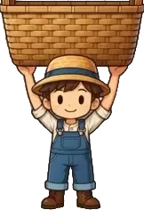

# 2025-group-30
2025 COMSM0166 group 30

# Table of Contents
- [1. Game & Game video](#1game--game-video)
- [2. Team](#2team)
- [3. Introduction](#3introduction)
- [4. Requirements](#4requirements)
- [5. Design](#5design)
- [6. Implementation](#6implementation)
- [7. Evaluation](#7evaluation)
- [8. Sustainability](#8sustainability)
- [9. Process](#9process)
- [10. Conclusion](#10conclusion)
- [11. Contribution Statement](#11contribution-statement)

# 1. Game & Game video

<p align="center">
  <a href="https://uob-comsm0166.github.io/2025-group-30/">
    
  </a>
</p>

<p align="center">
  <a href="https://uob-comsm0166.github.io/2025-group-30/">Play the game here</a>
</p>

Our game lives in the [docs](/docs) folder, and is published using Github pages to the link above.

Watch the demo video
[🎬 here](https://github.com/UoB-COMSM0166/2025-group-30/blob/nemo/videos/demo%20video.MP4)

# 2. Team

<p align="center">
  <br><i> Figure 1: Group photo of the team</i></br>
  
</p>
  
<p align="center">
    <i>Table 1: Team members, from Left to Right of Figure 1</i>
</p>

<div align="center">

| Name         | Email                                                 | GitHub username |
| ------------ | ----------------------------------------------------- | --------------- |
| Lingchen Li  | [yf24777@bristol.ac.uk](mailto:yf24777@bristol.ac.uk) | lingchen2333    |
| Hanying Bian | [oo24343@bristol.ac.uk](mailto:oo24343@bristol.ac.uk) | Hanying-Bian    |
| Liyang Li    | [gq24742@bristol.ac.uk](mailto:gq24742@bristol.ac.uk) | Misaki-1        |
| Lei Gao      | [yt24392@bristol.ac.uk](mailto:yt24392@bristol.ac.uk) | Muilka          |
| Shiyu Dou    | [hl24597@bristol.ac.uk](mailto:hl24597@bristol.ac.uk) | hl24597         |
| Zhuoyan Qiu  | [rp24358@bristol.ac.uk](mailto:rp24358@bristol.ac.uk) | 1003-qzy        |

</div>

# 3.Introduction

Our game is a lighthearted, fast-paced stacking challenge inspired by a classic mini-game from Mole Manor, reimagined with a fresh farmyard twist. Set during harvest season, players must move their character left and right to catch falling haystacks and deposit them into a barrel before time runs out. The goal: hit the hay collection target to progress to the next level.

What sets our game apart is the blend of intuitive mechanics with subtle strategy. Players can carry up to five haystacks at once—exceeding this limit causes them to stumble and lose everything, introducing a risk-reward dynamic that keeps the action engaging. As players gather more hay, their movement slows, forcing thoughtful decisions about when to offload and when to keep stacking.

Beyond its core mechanic, the game introduces novel twists to deepen the experience. In single-player mode, players must dodge falling obstacles like shovels while collecting power-up items. In two-player mode, players can either team up in cooperative gameplay with a shared hay quota, or face off competitively in a race to complete their goal first.

By combining charming visuals, progressively tricky mechanics, and multiple play modes, our game offers an accessible yet addictive take on the stacking genre. Whether playing solo or with a friend, players are treated to a fun and strategic farming experience that's easy to pick up but hard to master.

The following table shows the main elements of the game:
<p align="center">
    <i>Table 2: Game Elements</i>
</p>

| Category           |                                         Image                                          | Description                                                               |
| :----------------- | :------------------------------------------------------------------------------------: | :------------------------------------------------------------------------ |
| Player with basket |         | Player collects hay bales to their basket.                                |
| Barrel             |                                          | A barrel where the caught hay bales in the basket are emptied to.         |
| Hay bale           |             | Catch to stack in player's basket.                                        |
| Shovel             |          | Cause player to lose all current stack if hits the player.                |
| Protein shake      |  | Increase player's strength temporarily so that they could carry more hay. |
| Speed boot         |      | Increase player's speed temporarily.                                      |

# 4. Requirements 

## Ideation Process

Our team initially brainstormed five distinct game concepts, which we narrowed down to [two](./assets_for_README/Initial_ideas.md) after group discussions evaluating feasibility, appeal, and gameplay potential. To explore these ideas further, we developed paper prototypes for both shortlisted concepts, allowing us to simulate and assess the core mechanics before moving forward.

<p align="center">
  <br>Figure 3: Paper Prototype for <a href="https://youtu.be/uvnLMF2GfXI">Haystacking </a></br>
  <a href="https://youtu.be/uvnLMF2GfXI">
    
  </a>
</p>

<p align="center">
  <br>Figure 4: Paper Prototype for <a href="https://youtu.be/uvnLMF2GfXI">Fireboy & Watergirl</a></br>
  <a href="https://youtu.be/kqHrW4fSKdE">
    
  </a>
</p>

During this process, we observed a shared preference within the team for mini-games that feature simple rules yet offer surprisingly engaging and addictive gameplay. We appreciated how these types of games require minimal time, effort, and cognitive load—making them ideal as casual, everyday stress relievers that can be played anywhere, at any time.

With these factors in mind, we ultimately selected Haystacking as our final concept. Its straightforward yet strategic mechanics and lighthearted tone aligned well with our vision for an accessible and enjoyable game experience.

## Identifying Stakeholders 

As shown in Figure 5, we conducted a stakeholder analysis using the Onion Model. This helped us to categorise key parties based on their proximity to the systme, understandand their needs and prioritise them accordingly during the development process.

<p align="center"><i>Figure 5: Onion Model of Haystacking Game</i></p>

<p align="center">
  
</p>

<p align="center">
    <i>Table 3: Stakeholders Analysis</i>
</p>

| Stakeholder       | Description                                                                                           |
| ----------------- | ----------------------------------------------------------------------------------------------------- |
| Group 30-2025     | Primary developers responsible for design, development, and implementation of the game                |
| Players           | Includes first-time player, old players, casual players, competitive, players with disability (motor) |
| Lecturers and TAs | Evaluators assessing project quality                                                                  |
| Other Teams       | Other student teams working on similar projects                                                       |
| Bystanders        | Potential future players who may be attracted to the game                                             |


## User Stories and Acceptance Criteria

Throughout the development processes, we continuously evaluated and refined our user stories after every sprint review to make sure our game align with evolving users requirements. This iterative approach allowed us to stay responsive to feedback and maintain a user-centered design focus. 

In the later stage, we also incorporated sustainability-conducive requirements from the Sustainability Awareness Framework (SusAF), which enabled us to evaluate the potential impacts of the game from a more holistic standpoint. Table 4 presents the finalised user stories along with their corresponding acceptance criteria.

<p align="center">
    <i>Table 4: User Story and Acceptance Criteria</i>
</p>

<table>
<tr>
  <th style="width: 12%;">User Type</th>
  <th style="width: 15%;">Epic</th>
  <th style="width: 35%;">User Story</th>
  <th style="width: 38%;">Acceptance Criteria</th>
</tr>

<tr>
  <td>Developer</td>
  <td>Modular Architecture</td>
  <td>As a developer, I want the game logic to be modular so that it is easy to maintain and expand later.</td>
  <td>Given I am updating the game, when I modify a gameplay function, then it should not affect unrelated systems or cause bugs.</td>
</tr>
<tr>
  <td>Casual Player</td>
  <td>Beginner-Friendly Experience</td>
  <td>As a casual player, I want the game controls to be simple and intuitive so that I can quickly learn and enjoy the game.</td>
  <td>Given I am playing the game, when I use the controls, then they should be minimal and easy to understand.</td>
</tr>
<tr>
  <td></td>
  <td></td>
  <td>As a casual player, I want a clear tutorial when I first enter the game so that I can quickly learn how to play.</td>
  <td>Given it is my first time entering the game, when I start playing, then a tutorial should appear explaining the basic controls and rules.</td>
</tr>
<tr>
  <td></td>
  <td></td>
  <td>As a casual player, I want a pause and resume function so that I can play at my own pace.</td>
  <td>Given I am in a game session, when I click the pause button, then I should be presented with options to pause, resume, or restart.</td>
</tr>
<tr>
  <td></td>
  <td>Replayability</td>
  <td>As a casual player, I want to replay levels to improve my skills and gain a sense of achievement.</td>
  <td>Given I complete a level, when I choose to replay, then I should be able to restart the same level without restrictions.</td>
</tr>
<tr>
  <td>Competitive Player</td>
  <td>Game Challenge</td>
  <td>As a competitive player, I want the game to become more challenging over time so that it remains engaging.</td>
  <td>Given the game progresses, when I reach higher levels, then the game should introduce faster speeds or new obstacles.</td>
</tr>
<tr>
  <td>Social Player</td>
  <td>Multiplayer Mode</td>
  <td>As a social player, I want to compete or cooperate with my friends so that we can play together.</td>
  <td>Given I enter multiplayer mode, when I choose competitive or co-op, then the game should support both modes and show rankings after matches.</td>
</tr>
<tr>
  <td>Player with motor disability</td>
  <td>Keyboard Accessibility</td>
  <td>As a player with motor disability, I want to navigate and interact with all parts of the game using the keyboard only, so that I don't have to use a mouse.</td>
  <td>Given I am in the game, when I use the keyboard (Tab, Shift+Tab, Enter, Esc), then I can access and operate all interactive elements without a mouse.</td>
</tr>
</table>


## Use Cases Breakdown

To better understand the interactions between the game and its users, we used a Use Case Model to describe the game's functional requirements.

<p align="center"><i>Figure 7: Use-Case Diagram</i></p>

<p align="center">
  
</p>

<p align="center">
    <i>Table 5: Use Case Specifications for: Stack Hay, Pause Game, and Start Game</i>
</p>

| **Element**          | **Stack Hay**                                                                   | **Pause Game**                                                                                           | **Start Game**                                                                               |
| -------------------- | ------------------------------------------------------------------------------- | -------------------------------------------------------------------------------------------------------- | -------------------------------------------------------------------------------------------- |
| **Actors**           | Player                                                                          | Player                                                                                                   | Player                                                                                       |
| **Description**      | Player catches the falling hay.                                                 | Player pauses the game.                                                                                  | Player starts the game and engages with core gameplay.                                       |
| **Main Flow**        | 1. Hay bales fall.<br>2. Player catches hay.<br>3. Hay is added to stack.       | 1. Player pauses the game.<br>2. System shows pause menu.<br>3. Player chooses Resume, Restart, or Exit. | 1. Player clicks "Start".<br>2. Game initializes.<br>3. Player interacts with game elements. |
| **Extensions**       | Perfect Stack (if balanced precisely)                                           | Resume, Restart, Exit                                                                                    | N/A                                                                                          |
| **Include**          | N/A                                                                             | N/A                                                                                                      | Move Left/Right, Stack Hay, Empty to Barrel, Avoid Obstacles, Catch Special Items            |
| **Alternative Flow** | 1. Hay bales fall.<br>2. Player fails to catch.<br>3. Hay disappears offscreen. | N/A                                                                                                      | N/A                                                                                          |

# 5.Design
<p align="center"><b>Figure 8: Class Diagram</b></p>
<div align="center">
  
</div>

# 6.Implementation
- 15% ~750 words
- Describe implementation of your game, in particular highlighting the three areas of challenge in developing your game. 

## Challenges

We encountered three main challenges when developing the game: 
1. Managing the timing of dropping objects
2. Implementing rule-based stacking mechanics
3. Managing screen switching logic

#### Challenge 1: Managing the timing of dropping objects

A key gameplay mechanic in Haystacking involves dropping hay bales and other items (e.g., shovels, speed boot) at regular intervals. To implement this, we initially used `setInterval()` function to call object drop every few seconds.

However, we ran into a timing issue when implementing pause and resume functionality. If the player paused and resumed the game multiple times, objects would begin dropping too frequently — sometimes multiple items would fall at once. After debugging, we found that every time the game was resumed, a new interval was being created without clearing the previous one, leading to multiple concurrent timers calling object drop.

To solve this, we updated the code to ensure that only one interval exists at any time. We used `clearInterval()` and set the reference to null before starting a new interval, which added a guard to prevent multiple intervals from stacking:

```javascript
if (dropInterval) {
  clearInterval(dropInterval);
  dropInterval = null;
}
dropInterval = setInterval(dropItem, dropRate);
```

This change allowed us to reliably manage the start and stop behavior of the object drops. It also made the codebase more maintainable and predictable when adding new features related to item timing or difficulty scaling.

#### Challenge 2: Implementing rule-based stacking mechanics

Initially, we planned to use a physics engine such as Matter.js to simulate the realistic falling and stackking of hay bales. However, we quickly realised it introduced significant complexity, including collision handling, rotation, and gravity simulations. We then opted for a simpler design of using only rectangular hay blocks in a cartoon-like asthetic. The challenge then becoame making the stacking feel realistic and rewarding.

We first introduced a minimum horizontal overlap thresholder for a hay bale to be considered caught. We also implemented some backback mechanisms such as a gradual speed decrease as the player take on more hay bales. We thought we should impose a penalty for missing any hay bale, so we added a `Flash` object to the `Player`, which would cause the player to freeze and flash for a 0.5s. However, many users complainted about this features during the initial evalutation process. In fast-paced later levels, players could enter a frustrating loop where a missed bale triggered a flash, which caused them to miss the next bale immediately upon resuming — resulting in a chain of unavoidable penalties. Therefore, we scraped this setting. However, we were able to repurposed the `Flash` mechanics to be activated when a player exceeds the maximum number of hay bales they could carry. 

Finally, to encourage precision, we implemented a `PerfectStack` reward system. If a player achieved a stacking alignment of 90% or greater with the hay bale or basket below, they received a time bonus. 

#### Challenge 3: Managing screen switching logic

As none of us had any prior experience with game development, one of the early challenges we faced was to implement the logic of switching between different screens.

At first, we started with a single-page prototype focused solely on the stacking mechanic. As we introduced additional screens (e.g. home screen, pause screen, gameplay, game over), we used simple conditional statements to handle the screen changes, e.g.:

```javascript
if (isPaused && screen === "game") {
    // ... game paused logic
} else if (screen === "home") {
    // ... home screen logic
}
```

However, as the number of screens grew, this became increasingly difficult to maintain. To solve this, we impletemented a state management class - `ScreenManager` which emcompasses different screens such as the game screens and home screens, and each of the game screen has their respective target score screen, level up screen etc. The `ScreenManager` also maintains a `currentScreen` property and has methods to change and display the current screen.

# 7.Evaluation

To ensure a balance between functionality and usability during the game development process, we chose to combine both qualitative and quantitative evaluation methods. Qualitative analysis helped us identify issues within the game, while quantitative evaluation provided insights into user perceptions, guiding us to iteratively improve the design.
## 7.1 Qualitative Evaluation - Heuristic Evaluation
 For the qualitative method, we adopted Heuristic Evaluation, a practical and widely used approach that examines the interface based on Nielsen's ten usability principles. By systematically reviewing each screen of our game, we identified several usability issues, including unclear navigation flow, inconsistent system feedback, limited user control, and lack of clarity in competitive scoring. Each issue was evaluated across three dimensions—Frequency, Impact, and Persistence—to calculate a severity score and prioritize the most critical problems.The results are shown in the following table:
<p align="center">
    <i>Table 5: Heuristic Evaluation Table</i>
</p>

<table>
  <tr>
    <th style="width: 15%;">Interface</th>
    <th style="width: 35%;">Issue</th>
    <th style="width: 25%;">Heuristic(s)</th>
    <th style="width: 5%;">F (0-4)</th>
    <th style="width: 5%;">I (0-4)</th>
    <th style="width: 5%;">P (0-4)</th>
    <th style="width: 10%;">Severity</th>
  </tr>
  <tr>
    <td>Main Menu</td>
    <td>The extra "Start" button is unnecessary; players should select the mode first and then start.</td>
    <td>User control and freedom</td>
    <td>3</td>
    <td>3</td>
    <td>3</td>
    <td>3.00</td>
  </tr>
  <tr>
    <td>Mode Selection</td>
    <td>The single-player or multiplayer selection screen lacks a button to return to the main menu.</td>
    <td>User control and freedom</td>
    <td>3</td>
    <td>3</td>
    <td>4</td>
    <td>3.33</td>
  </tr>
  <tr>
    <td>Multiplayer End</td>
    <td>Missing score comparison prevents players from visually comparing their scores.</td>
    <td>Visibility of system status</td>
    <td>3</td>
    <td>3</td>
    <td>4</td>
    <td>3.33</td>
  </tr>
  <tr>
    <td>Multiplayer Gameplay</td>
    <td>The time display is only on the left side, making it difficult for the right-side player to see the remaining time.</td>
    <td>Visibility of system status</td>
    <td>4</td>
    <td>3</td>
    <td>4</td>
    <td>3.67</td>
  </tr>
  <tr>
    <td>Gameplay Speed</td>
    <td>The hay-cutting speed varies on different platforms, affecting the gaming experience.</td>
    <td>Error prevention</td>
    <td>4</td>
    <td>4</td>
    <td>4</td>
    <td>4.00</td>
  </tr>
  <tr>
    <td>Character Store</td>
    <td>The lack of a store system prevents players from selecting different characters or hay-cutting tools.</td>
    <td>Flexibility and efficiency of use</td>
    <td>3</td>
    <td>2</td>
    <td>3</td>
    <td>2.67</td>
  </tr>
  <tr>
    <td>Multiplayer Gameplay</td>
    <td>In multiplayer mode, the character/tool selection cannot meet the personalized needs of different players.</td>
    <td>Flexibility and efficiency of use</td>
    <td>3</td>
    <td>2</td>
    <td>3</td>
    <td>2.67</td>
  </tr>
</table>

Based on the severity scores in the evaluation table, we will prioritize addressing high-severity issues, such as speed inconsistency across platforms and insufficient time display in multiplayer mode.    next development focus will be on enhancing the user experience by improving UI feedback, adding return and help buttons, and introducing a store system for character/tool customization. Through these improvements, we aim to create a smoother, more intuitive, and more engaging gameplay experience.

## 7.2 Quantitative Evaluation - SUS evaluation
We collected and analyzed SUS questionnaire data from 12 users for both Level 1 and Level 2, calculating their total SUS scores. We then used the Wilcoxon Signed-Rank Test to examine whether there was a statistically significant difference in usability scores between the two levels. Click [here](sus.md) to see the raw data.

<p align="center"><b>Figure 10: SUS Score Distribution Chart</b></p>
<div align="center">
  
</div>

<p align="center"><b>Figure 11: Average Score Chart</b></p>
<div align="center">
  
</div>
The results of the Wilcoxon Signed-Rank Test for the System Usability Scale (SUS) scores show no statistically significant difference between the two difficulty levels (W = 10.5, p = 0.5461). Although individual user scores vary slightly, both the easy and hard levels received generally high SUS scores. This suggests that users found the game to be consistently usable across both difficulty settings.

## 7.3 Test
We mainly conducted black-box testing for the game. The test cases were designed based on the equivalence partitioning method and focused on core game functionalities. Testing covered five major areas: game mode selection, player movement control, hay block collection mechanics, score calculation system, and shovel item system.
Each test case was designed following the equivalence class principle, covering valid inputs, invalid inputs, and boundary conditions.
The test results showed that all core functionalities are working correctly, including interface responsiveness, player control accuracy, game mechanic stability, score calculation correctness, and item system functionality.
Special attention was given to boundary condition handling, such as screen edge limits, barrel capacity limits, and time limits, ensuring the game operates normally under all conditions.
All test cases passed, indicating that the core functions have been successfully implemented and are operating correctly.
<p align="center">
    <i>Table 6: Black-Box Test Table</i>
</p>

| Test ID |   Test Type    |                Input Condition                | Equivalence Class  |         Expected Output         |                     Actual Output                      | Test Result |
| :-----: | :------------: | :-------------------------------------------: | :----------------: | :-----------------------------: | :----------------------------------------------------: | :---------: |
|  GM-01  | UI Interaction |         Click "Single Player" button          |    Valid Input     | Enter single-player help screen |     Successfully entered single-player help screen     |   Passed    |
|  GM-02  | UI Interaction |           Click "Co-op Mode" button           |    Valid Input     |  Enter co-op mode help screen   |      Successfully entered co-op mode help screen       |   Passed    |
|  GM-03  | UI Interaction |            Click "PvP Mode" button            |    Valid Input     |   Enter PvP mode help screen    |       Successfully entered PvP mode help screen        |   Passed    |
|  GM-04  | UI Interaction |              Click on blank area              |   Invalid Input    |  Remain on the current screen   |               Screen remained unchanged                |   Passed    |
|  PM-01  | Player Control |             Press left arrow key              |    Valid Input     |        Player moves left        |               Player moves left smoothly               |   Passed    |
|  PM-02  | Player Control |             Press right arrow key             |    Valid Input     |       Player moves right        |              Player moves right smoothly               |   Passed    |
|  PM-03  | Player Control | Press both left and right keys simultaneously |   Invalid Input    |    Player remains stationary    |               Player remains stationary                |   Passed    |
|  PM-04  | Player Control |        Player reaches screen boundary         | Boundary Condition |       Player stops moving       |                Player stops at boundary                |   Passed    |
|  GC-01  | Game Mechanics |    Player successfully catches a hay block    |    Valid Input     |     Hay block enters barrel     |         Hay block enters barrel with animation         |   Passed    |
|  GC-02  | Game Mechanics |          Player misses the hay block          |    Valid Input     |   Hay block continues to fall   |       Hay block continues falling and disappears       |   Passed    |
|  GC-03  | Game Mechanics |    Barrel is full when catching hay block     | Boundary Condition |   Hay block continues to fall   |             Hay block cannot enter barrel              |   Passed    |
|  GC-04  | Game Mechanics |      Hay block falls outside the barrel       | Boundary Condition |      Hay block disappears       |       Hay block disappears after touching ground       |   Passed    |
|  SC-01  |  Score System  |       Successfully collect a hay block        |    Valid Input     |   Score increases by 1 point    |          Score correctly increases by 1 point          |   Passed    |
|  SC-02  |  Score System  |          Perfectly stack hay blocks           |    Valid Input     |   Gain additional time reward   | Special effects displayed, time increased by 5 seconds |   Passed    |
|  SC-03  |  Score System  |              Reach target score               | Boundary Condition |      Advance to next level      |  Level-clear animation displayed, moved to next level  |   Passed    |
|  SC-04  |  Score System  |     Time runs out before reaching target      | Boundary Condition |            Game over            |               Game over screen displayed               |   Passed    |
|  SH-01  |  Item System   |         Press space key to use shovel         |    Valid Input     |     Shovel launches forward     |                Shovel launched forward                 |   Passed    |
|  SH-02  |  Item System   |            Shovel hits an opponent            |    Valid Input     |    Opponent is knocked back     |          Opponent knocked back with animation          |   Passed    |
|  SH-03  |  Item System   |          Shovel durability runs out           | Boundary Condition |      Unable to use shovel       |                 Shovel icon turns gray                 |   Passed    |
|  SH-04  |  Item System   |           Shovel misses the target            |    Valid Input     | Shovel disappears after flying  |            Shovel disappeared after flying             |   Passed    |

# 8.Sustainability

## 8.1 Introducing Green Software Design Principles

In today's digital era where environmental awareness and technological advancement go hand in hand, software is not only expected to deliver functionality, but also to operate sustainably. As high-frequency and long-session digital media, games involve complex graphics rendering, logical processing, and user-driven interactions—all of which contribute to device energy consumption and environmental impact.

To align with green software development, we referenced the Green Software Patterns proposed by the Green Software Foundation. These patterns guide the development process from multiple angles—such as performance, resource efficiency, user behavior, and architectural structure—to achieve sustainable and energy-efficient game design.

## 8.2 Identifying Green Logic Chains from Real-World Issues

During the early discussion phase of our project, we analyzed key sustainability challenges based on the operational characteristics of our game. These challenges span multiple dimensions:

Excessive graphics rendering causes overheating and power drain.

Multiplayer experiences require multiple devices, resulting in low hardware utilization.

Repetitive asset design leads to resource waste and maintenance overhead.

Lack of modular structure increases redundant code and reduces energy efficiency.

Building upon these identified issues, we abstracted green logic chains based on green design principles and integrated them into our game development workflow.

## 8.3 Green Logic Chains and Deductive Paths

- UI and Visual Design

Keywords: Graphics load, rendering efficiency, minimal visual complexityProblem Source: Complex visuals and frequent animations overload the GPU/CPUDeduction Logic: Reduce visual complexity → Lower image processing → Save energyImplementation:
Use pixel-style, low-resolution assets
Keep sessions short and load only necessary assets using lazy loading
Avoid complex animations and optimize render rate

- Asset Reuse

Keywords: Repetitive content, resource redundancy, storage overheadProblem Source: Designing new assets for each level leads to wasteDeduction Logic: Modularize assets → Enable reuse → Reduce development and loading costImplementation:
Reuse hay, barrels, and character sprites across levels
Manage assets uniformly to reduce redundant storage and image loading cost

- Shared Optimization

Keywords: Device burden, social interaction, shared hardwareProblem Source: Multiplayer play demands multiple devicesDeduction Logic: Support same-device multiplayer → Improve utilization → Reduce hardware energy useImplementation:
Enable two-player collaboration and turn-based modes
Encourage all gameplay to occur on a single shared device

- Code Optimization

Keywords: Structural redundancy, execution efficiency, maintainabilityProblem Source: Mixed logic and redundant structures lead to low system efficiencyDeduction Logic: Modular structure → Reduce repetition → Improve performance and lower energy useImplementation:
Clearly divided functions like dropHay() and checkCatch()
Decoupled structure to avoid unnecessary refreshes or duplicate checks

## 8.4 Visualization of Sustainability Impact Pathways

To better visualize the sustainability logic in Hay-stacking, we mapped our design decisions to the five dimensions of the SusAF model—Individual, Social, Technical, Environmental, and Economic—following the Immediate → Enabling → Structural logic. Each design pattern contributes not only to immediate efficiency, but also to long-term structural sustainability.

<p align="center"><b>Figure 12: Sustainability Awareness Diagram</b></p>
<p align="center">
  
</p>


As shown in the figure:

In the technical dimension, resource redundancy is reduced through asset compression, streamlined logic structures, and modular code.

In the environmental dimension, low-resolution graphics and lazy loading effectively lower rendering energy consumption.

In the economic dimension, asset reuse and shared device usage reduce development and maintenance costs.

In the social dimension, cooperative mechanics and fair-play systems enhance user interaction and resource sharing.

In the individual dimension, short session design and low-pressure gameplay help players establish healthy usage patterns.

## 8.5 Sustainability Implementation via SusAF Dimensions

Throughout the design and development of this game, we adopted several green software engineering strategies focused on three core goals: reducing resource consumption, increasing device utilization, and minimizing environmental impact. These approaches align with the five dimensions of the Sustainability Awareness Framework (SusAF)—environmental, technical, economic, individual, and social—and incorporate best practices from the Green Software Foundation Patterns.

- Energy-efficient UI and system design (Environmental + Technical)

The game features a minimalist pixel-art style and low-resolution assets, significantly reducing GPU rendering demands. By simplifying animations and offering short-session gameplay with lazy-loading techniques, we limit CPU and memory usage during runtime. These decisions contribute to lower energy consumption and extended device lifespan, aligning with the Demand Shaping and Green Hosting patterns.

- Shared device and multiplayer optimization (Social + Economic)

We support local two-player modes—either co-op or alternating turns—allowing multiple users to share a single device. This reduces the need for additional hardware purchases and enhances the usage rate of existing devices, thereby decreasing e-waste. The approach reflects the Substitution and Behaviour Change principles in promoting sustainable patterns of production and consumption.

- Reusable assets across levels (Technical + Environmental)

Common assets—such as hay blocks, barrels, and character models—are reused across multiple levels, avoiding redundant design work and reducing digital resource overhead. This follows the Material Optimization pattern, lowering both development and storage costs, and reducing the carbon footprint associated with asset creation and management.

- Modular and clean code structure (Technical + Economic)

The game logic is divided into clear, maintainable modules with optimized, lightweight code. This ensures efficient resource use, improves responsiveness, and simplifies long-term maintenance and scalability. These practices reflect the principles of Sustainable Software Architecture, contributing to both system efficiency and development cost reduction.

Through these sustainability practices, our game actively addresses the environmental and technical challenges of software engineering. These efforts not only reduce the environmental burden of the product but also enhance the overall efficiency, maintainability, and user experience of the system.

## 8.6 Conclusion

By following a structured path of problem identification → pattern matching → logic deduction → implementation, our development of Hay-stacking embedded green design at every level. This not only improved system performance but also reduced environmental impact and promted sustainable awareness among players. The approach provides a reproducible model for future green game design and sustainable software engineering.

# 9.Process

In this project, our team adopted the **Scrum** framework, a core methodology in Agile development, to organize teamwork and manage task progression. This approach ensured our project followed a structured workflow while staying aligned with the weekly teaching schedule.

### 9.1 Project Management and Task Allocation

We used **GitHub's Kanban Board** to visualize project tasks and track progress. Each week, based on the course schedule, we set **Sprint goals** and assigned tasks to team members. Tasks were categorized into three stages:

- **To Do**
- **In Progress**
- **Done**

Responsibilities such as asset creation, audio collection, and documentation were distributed organically among team members, reflecting our self-organizing working style. This helped us clearly monitor each task's status and streamline our workflow.

<p align="center"><b>Figure 13: Kanban Board</b></p>
<div align="center">
  
</div>

### 9.2 Version Control and Code Management
We used **Git** for version control. Each member worked on their own **feature branch**. After completing their work, they submitted a **Pull Request** for code review. Only after approval would the code be merged into the `main` branch.  
This ensured code quality and minimized the risk of conflicts.

### 9.3 Team Meetings and Collaboration
We held **meetings every week** to:
- Review current progress
- Analyze completed tasks
- Discuss existing issues
- Distribute new tasks

After each meeting, we updated the **Kanban board** to reflect progress and task updates, keeping everyone aligned. Even for bug fixing or visual polish tasks, the team collaborated without rigid role assignments.

### 9.4 Communication Tools
We used **WhatsApp** for quick daily communication and **Teams** for formal discussions and screen sharing.  
This setup supported efficient, consistent collaboration, even during remote work.

### 9.5 Agile Practices and Flexibility
While our work followed a Sprint-based structure, internal task distribution remained flexible. Members took initiative to work on tasks based on their interests and expertise.  
Tasks such as tutorial UI, sound design, asset preparation, and even bug fixing were shared among the team in a collaborative and adaptive way. This self-organizing model allowed us to stay responsive, communicate openly, and maintain consistent progress.

### 9.6 Summary
By combining **Scrum methodology**, **Kanban-based task tracking**, and **frequent team communication**, we enhanced our development efficiency, maintained progress, and built a strong, collaborative work environment. 

# 10.Conclusion

Through the development of our farm-themed stacking game, our team has gained valuable hands-on experience in the entire software development lifecycle—from ideation and prototyping to implementation and evaluation. The process not only improved our programming skills but also taught us how to manage a project collaboratively using Agile methods. Weekly sprints, regular meetings, and clear role distribution allowed us to keep track of progress and adapt swiftly to changes.

Throughout the project, we encountered several technical and design challenges, such as managing object drop timing, balancing gameplay difficulty, and ensuring stable cross-platform performance. To address these issues, we constantly made trade-offs, refined debugging skills, and adjusted mechanics based on continuous testing and user feedback. These experiences significantly deepened our understanding of modular code architecture and user-centered development.

Additionally, we prioritized sustainability and accessibility in our development. By reusing assets, designing for short gameplay sessions, supporting local multiplayer, and implementing basic accessibility features, we created a game that is both environmentally friendly and inclusive. In particular, our design is more accessible for players with motor disabilities, reflecting our commitment to user diversity.

In the near future, we plan to introduce new game items such as freeze sprays, glue bottles, and magnetic gloves to further enrich gameplay. These items will introduce new tactical options—such as hindering opponents or boosting speed—making the game more dynamic and engaging. We also aim to expand level design and improve visual effects to enhance immersion. And in the long run, we aim to implement online multiplayer functionality, allowing players to compete or cooperate remotely. As our technical capabilities grow, we also plan to introduce a progression system, global leaderboard, and story mode—adding longevity and depth to the game experience.

# 11.Contribution Statement
| Name         | Contribution |
| ------------ | ------------ |
| Lingchen Li  |              |
| Lei Gao      |              |
| Hanying Bian |              |
| Shiyu Dou    |              |
| Zhuoyan Qiu  |              |
| Liyang Li    |              |