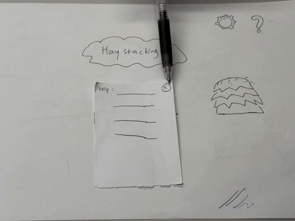
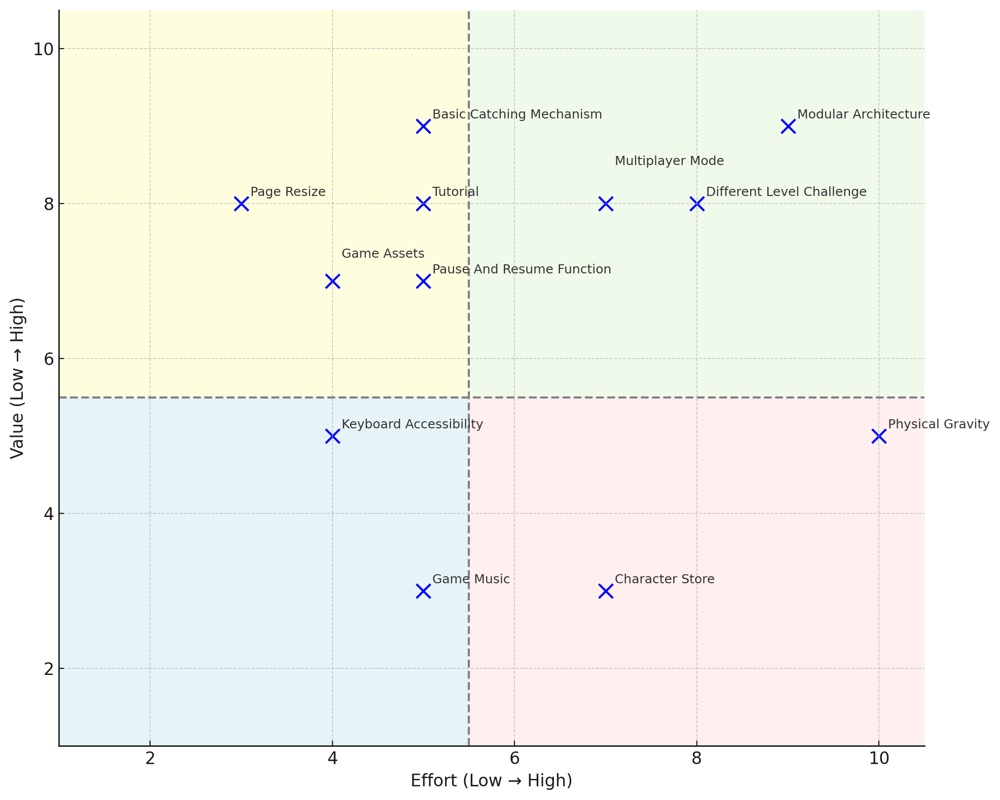
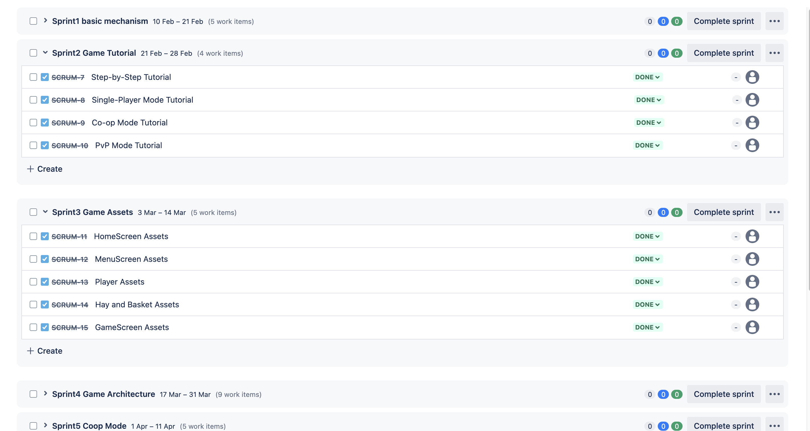

# 2025-group-30
2025 COMSM0166 group 30

# Table of Contents
- [1. Game & Game video](#1-game--game-video)
- [2. Team](#2-team)
- [3. Introduction](#3-introduction)
- [4. Requirements](#4-requirements)
- [5. Design](#5-design)
- [6. Implementation](#6-implementation)
- [7. Evaluation](#7-evaluation)
- [8. Sustainability, Ethics and Accessibility](#8-sustainability-ethics-and-accessibility)
- [9. Process](#9-process)
- [10. Conclusion](#10-conclusion)
- [11. Contribution Statement](#11-contribution-statement)
- [12. References](#12-references)

# 1. Game & Game video

<p align="center">
  <a href="https://uob-comsm0166.github.io/2025-group-30/">
    
  </a>
</p>

<p align="center">
  <a href="https://uob-comsm0166.github.io/2025-group-30/">Play the game here</a>
</p>

Our game lives in the [docs](/docs) folder, and is published using Github pages to the link above.

Watch the demo video
[🎬 here](https://github.com/UoB-COMSM0166/2025-group-30/blob/nemo/videos/demo%20video.MP4)

# 2. Team

<p align="center">
  <br><i> Figure 1: Group photo of the team</i></br>
  
</p>
  
<p align="center">
    <i>Table 1: Team members, from Left to Right of Figure 1</i>
</p>

<div align="center">

| Name         | Email                                                 | GitHub username |
| ------------ | ----------------------------------------------------- | --------------- |
| Lingchen Li  | [yf24777@bristol.ac.uk](mailto:yf24777@bristol.ac.uk) | lingchen2333    |
| Hanying Bian | [oo24343@bristol.ac.uk](mailto:oo24343@bristol.ac.uk) | Hanying-Bian    |
| Liyang Li    | [gq24742@bristol.ac.uk](mailto:gq24742@bristol.ac.uk) | Misaki-1        |
| Lei Gao      | [yt24392@bristol.ac.uk](mailto:yt24392@bristol.ac.uk) | Muilka          |
| Shiyu Dou    | [hl24597@bristol.ac.uk](mailto:hl24597@bristol.ac.uk) | hl24597         |
| Zhuoyan Qiu  | [rp24358@bristol.ac.uk](mailto:rp24358@bristol.ac.uk) | 1003-qzy        |

</div>

# 3. Introduction

Our game is a lighthearted, fast-paced stacking challenge inspired by a classic mini-game from Mole Manor, reimagined with a fresh farmyard twist. Set during harvest season, players must move their character left and right to catch falling haystacks and deposit them into a barrel before time runs out. The goal: hit the hay collection target to progress to the next level.

What sets our game apart is the blend of intuitive mechanics with subtle strategy. Players can carry up to five haystacks at once—exceeding this limit causes them to stumble and lose everything, introducing a risk-reward dynamic that keeps the action engaging. As players gather more hay, their movement slows, forcing thoughtful decisions about when to offload and when to keep stacking.

Beyond its core mechanic, the game introduces novel twists to deepen the experience. In single-player mode, players must dodge falling obstacles like shovels while collecting power-up items. In two-player mode, players can either team up in cooperative gameplay with a shared hay quota, or face off competitively in a race to complete their goal first.

By combining charming visuals, progressively tricky mechanics, and multiple play modes, our game offers an accessible yet addictive take on the stacking genre. Whether playing solo or with a friend, players are treated to a fun and strategic farming experience that's easy to pick up but hard to master.

The following table shows the main elements of the game:
<p align="center">
    <i>Table 2: Game Elements</i>
</p>

| Category           |                                         Image                                         | Description                                                               |
| :----------------- | :-----------------------------------------------------------------------------------: | :------------------------------------------------------------------------ |
| Player with basket |        | Player collects hay bales to their basket.                                |
| Barrel             |                                         | A barrel where the caught hay bales in the basket are emptied to.         |
| Hay bale           |            | Catch to stack in player's basket.                                        |
| Shovel             |         | Cause player to lose all current stack if hits the player.                |
| Protein shake      |  | Increase player's strength temporarily so that they could carry more hay. |
| Speed boot         |     | Increase player's speed temporarily.                                      |

# 4. Requirements 

Requirements engineering (RE) is a crucial component of software development, as the success of a project heavily relies on how accurately its requirements are identified during this phase [[1]](#12-references). Unlike traditional development models, where RE is typically confined to the early stages, agile development views RE as an ongoing process throughout the entire development cycle, with continuous refinement and adaptation as the project progresses [[2]](#12-references).

## Ideation Process

Our team initially brainstormed five distinct game concepts, which we narrowed down to [two](./assets_for_README/Initial_ideas.md) after group discussions evaluating feasibility, appeal, and gameplay potential. To explore these ideas further, we developed paper prototypes for both shortlisted concepts, allowing us to simulate and assess the core mechanics before moving forward.

<p align="center">
  <br><i>Figure 2: Paper Prototype for <a href="https://youtu.be/uvnLMF2GfXI">Haystacking </a></i></br>
  <a href="https://youtu.be/uvnLMF2GfXI">
    
  </a>
</p>

<p align="center">
  <br><i>Figure 3: Paper Prototype for <a href="https://youtu.be/uvnLMF2GfXI">Fireboy & Watergirl</a></i></br>
  <a href="https://youtu.be/kqHrW4fSKdE">
    
  </a>
</p>

During this process, we observed a shared preference within the team for mini-games that feature simple rules yet offer surprisingly engaging and addictive gameplay. We appreciated how these types of games require minimal time, effort, and cognitive load—making them ideal as casual, everyday stress relievers that can be played anywhere, at any time.

With these factors in mind, we ultimately selected Haystacking as our final concept. Its straightforward yet strategic mechanics and lighthearted tone aligned well with our vision for an accessible and enjoyable game experience.

## Identifying Stakeholders 

As shown in Figure 4, we conducted a stakeholder analysis using the Onion Model. This helped us to categorise key parties based on their proximity to the systme, understandand their needs and prioritise them accordingly during the development process.

<p align="center"><i>Figure 4: Onion Model of Haystacking Game</i></p>

<p align="center">
  
</p>

<p align="center">
    <i>Table 3: Stakeholders Analysis</i>
</p>

| Stakeholder       | Description                                                                                                 |
| ----------------- | ----------------------------------------------------------------------------------------------------------- |
| Group 30-2025     | Primary developers responsible for design, development, and implementation of the game                      |
| Players           | Includes first-time player, returning players, casual players, competitive, players with disability (motor) |
| Lecturers and TAs | Evaluators assessing project quality                                                                        |
| Other Teams       | Other student teams working on similar projects                                                             |
| Bystanders        | Potential future players who may be attracted to the game                                                   |


## User Stories and Acceptance Criteria

Throughout the development processes, we continuously evaluated and refined our user stories after every sprint review to make sure our game align with evolving users requirements. This iterative approach allowed us to stay responsive to feedback and maintain a user-centered design focus. 

In the later stage, we also incorporated sustainability-conducive requirements from the Sustainability Awareness Framework (SusAF), which enabled us to evaluate the potential impacts of the game from a more holistic standpoint. Table 4 presents the finalised user stories along with their corresponding acceptance criteria.

<p align="center">
    <i>Table 4: User Story and Acceptance Criteria</i>
</p>

<table>
<tr>
  <th style="width: 10%;">User Type</th>
  <th style="width: 18%;">Epic</th>
  <th style="width: 36%;">User Story</th>
  <th style="width: 36%;">Acceptance Criteria</th>
</tr>

<tr>
  <td>Developer</td>
  <td>Modular Architecture</td>
  <td>As a developer, I want the game logic to be modular so that it is easy to maintain and expand later.</td>
  <td>Given I am updating the game, when I modify a gameplay function, then it should not affect unrelated systems or cause bugs.</td>
</tr>
<tr>
  <td>Casual Player</td>
  <td>Beginner-Friendly Experience</td>
  <td>As a casual player, I want the game controls to be simple and intuitive so that I can quickly learn and enjoy the game.</td>
  <td>Given I am playing the game, when I use the controls, then they should be minimal and easy to understand.</td>
</tr>
<tr>
  <td></td>
  <td></td>
  <td>As a casual player, I want a clear tutorial when I first enter the game so that I can quickly learn how to play.</td>
  <td>Given it is my first time entering the game, when I start playing, then a tutorial should appear explaining the basic controls and rules.</td>
</tr>
<tr>
  <td></td>
  <td></td>
  <td>As a casual player, I want a pause and resume function so that I can play at my own pace.</td>
  <td>Given I am in a game session, when I click the pause button, then I should be presented with options to pause, resume, or restart.</td>
</tr>
<tr>
  <td></td>
  <td>Replayability</td>
  <td>As a casual player, I want to replay levels to improve my skills and gain a sense of achievement.</td>
  <td>Given I complete a level, when I choose to replay, then I should be able to restart the same level without restrictions.</td>
</tr>
<tr>
  <td>Competitive Player</td>
  <td>Game Challenge</td>
  <td>As a competitive player, I want the game to become more challenging over time so that it remains engaging.</td>
  <td>Given the game progresses, when I reach higher levels, then the game should introduce faster speeds or new obstacles.</td>
</tr>
<tr>
  <td>Social Player</td>
  <td>Multiplayer Mode</td>
  <td>As a social player, I want to compete or cooperate with my friends so that we can play together.</td>
  <td>Given I enter multiplayer mode, when I choose competitive or co-op, then the game should support both modes and show rankings after matches.</td>
</tr>
<tr>
  <td>Player with motor disability</td>
  <td>Keyboard Accessibility</td>
  <td>As a player with motor disability, I want to navigate and interact with all parts of the game using the keyboard only, so that I don't have to use a mouse.</td>
  <td>Given I am in the game, when I use the keyboard (Tab, Shift+Tab, Enter, Esc), then I can access and operate all interactive elements without a mouse.</td>
</tr>
<tr>
  <td>Player</td>
  <td>Support Individual Health, Safety, and Learning</td>
  <td>As a player, I want the game to have a clear end (5 levels only) so that I don't feel the need to keep playing endlessly.</td>
  <td>Given I am in the game, when I finish the 5th level, then I should see a completion screen.</td>
</tr>
<tr>
  <td>Player</td>
  <td>Support Individual Health, Safety, and Learning</td>
  <td>As a player, I want to play the game without logging in or giving personal data so that my privacy is protected.</td>
  <td>Given I am in the game web page, when I want to start palying the game, then I should be able to do so without needing to login or signup.</td>
</tr>
</table>


## Use Cases Breakdown

To better understand the interactions between the game and its users, we used a Use Case Model to describe the game's functional requirements.

<p align="center"><i>Figure 5: Use-Case Diagram</i></p>

<p align="center">
  
</p>

<p align="center">
    <i>Table 5: Use Case Specifications for: Stack Hay, Pause Game, and Start Game</i>
</p>

| **Element**          | **Stack Hay**                                                                   | **Pause Game**                                                                                           | **Start Game**                                                                               |
| -------------------- | ------------------------------------------------------------------------------- | -------------------------------------------------------------------------------------------------------- | -------------------------------------------------------------------------------------------- |
| **Actors**           | Player                                                                          | Player                                                                                                   | Player                                                                                       |
| **Description**      | Player catches the falling hay.                                                 | Player pauses the game.                                                                                  | Player starts the game and engages with core gameplay.                                       |
| **Main Flow**        | 1. Hay bales fall.<br>2. Player catches hay.<br>3. Hay is added to stack.       | 1. Player pauses the game.<br>2. System shows pause menu.<br>3. Player chooses Resume, Restart, or Exit. | 1. Player clicks "Start".<br>2. Game initializes.<br>3. Player interacts with game elements. |
| **Extensions**       | Perfect Stack (if balanced precisely)                                           | Resume, Restart, Exit                                                                                    | N/A                                                                                          |
| **Include**          | N/A                                                                             | N/A                                                                                                      | Move Left/Right, Stack Hay, Empty to Barrel, Avoid Obstacles, Catch Special Items            |
| **Alternative Flow** | 1. Hay bales fall.<br>2. Player fails to catch.<br>3. Hay disappears offscreen. | N/A                                                                                                      | N/A                                                                                          |

# 5. Design
- 15% ~750 words 
- System architecture. Class diagrams, behavioural diagrams

Having analysed the system requirements, we then proceeded to the design phase. We adopted object-oriented (OO) design principles to create a modular and maintainable sytstem architecture.

Our design follows closely to core OO principles. Abstraction is used to define base classes such as Screen and `FallingObject`, which provide common functionality to their subclasses while hiding specific implementations. Encapsulation ensures that classes like `Player` manage their internal state—such as their haystack stack and scoring logic—independently. Inheritance is used to structure the system logically; for example, `Single`, `Coop`, and `Pvp` all extend from GameScreen to reuse shared logic. Polymorphism allows different object types (e.g., game modes, falling objects) to implement shared methods in different ways, facilitating flexibility and code clarity. Collectively, these principles allowed us to design a clean and extendable system.

### Class diagram

We created a class diagram to present the static relatonships between objects. To improve readability and focus on high-level structure, only key attributes and methods are shown. 


<p align="center"><i>Figure 6: Class Diagram</i></p>
<div align="center">
  
</div>

Some of the key classes and relationships highlighted in the design:

1. **Screen hierarchy**: `Screen` is the abstract base class for all screens in the game. `GameScreen` extends `Screen` and is the base class for all gameplay screens (Single, Coop, Pvp). A `ScreenManager` manages all screens and handles transitions between them.

2. **Game modes**: `Single` player mode has one player and one barrel. `Coop` mode has two players sharing one barrel, while `Pvp` mode has two players and two barrels.

3. **Player**: Each `Player` manages a stack of `Hay` objects and is connected to a `Barrel` for scoring. It also interacts with a `SoundManager` for feedback and includes visual effects such as `Flash`.

4. **Game objects**: `FallingObject` is an abstract class extended by `Hay` and `SpecialItem`. Specific SpecialItem types (e.g. `Shovel`, `ProteinShake`, `SpeedBoot`) implement unique gameplay effects..

5. **Game logic**: `Level` manages game progression and modes. `Barrel` handles scoring and target scores

6. **Sound management**: `SoundManager` is a central class for handling all game audio. It maintains a map of sound effects and provides methods for playing sounds and controlling volume. It is connected to `ScreenManager` via composition and `Player` via aggragation.

7. **Help system**: `StepByStepHelpScreen` is an interactive tutorial. `SingleHelpScreen` is for single player mode, whereas `DoubleHelpScreen` is an abstract base for two-player help screens: `CoopHelpScreen` and `PvpHelpScreen`.


### Sequence diagram

To demonstrate the dynamic behaviour of the system, we first developed a sequence diagram that focuses on the basic single-player mode, as shown in Figure 7. This diagram illustrates the flow of messages exchanged between objects during gameplay, how components collaborate to manage user input, object movement, collision detection, and game state updates.

<p align="center"><i>Figure 7: Sequence diagram for Single mode</i></p>

<p align="center">
  
</p>


Building on the single-player sequence diagram, we subsequently developed sequence diagrams for both co-op (Figure 8) and PvP modes (Figure 9). In the co-op mode, the core game mechanics remain consistent with single-player gameplay; however, both players contribute to a shared barrel, reflecting a combined scoring system. In contrast, the PvP mode introduces independent barrels and scoring for each player, along with additional win, lose, or draw conditions determined by comparing individual scores at the end of the game.

<p align="center"><i>Figure 8: Sequence diagram for Coop mode</i></p>

<p align="center">
  
</p>

<p align="center"><i>Figure 9: Sequence diagram for PvP mode</i></p>

<p align="center">
  
</p>


# 6. Implementation
- 15% ~750 words
- Describe implementation of your game, in particular highlighting the three areas of challenge in developing your game. 

## Challenges

We encountered three main challenges when developing the game: 
1. Managing the timing of dropping objects
2. Implementing rule-based stacking mechanics
3. Managing screen switching logic

#### Challenge 1: Managing the timing of dropping objects

A key gameplay mechanic in Haystacking involves dropping hay bales and other items (e.g., shovels, speed boot) at regular intervals. To implement this, we initially used `setInterval()` function to call object drop every few seconds.

However, we ran into a timing issue when implementing pause and resume functionality. If the player paused and resumed the game multiple times, objects would begin dropping too frequently — sometimes multiple items would fall at once. After debugging, we found that every time the game was resumed, a new interval was being created without clearing the previous one, leading to multiple concurrent timers calling object drop.

To solve this, we updated the code to ensure that only one interval exists at any time. We used `clearInterval()` and set the reference to null before starting a new interval, which added a guard to prevent multiple intervals from stacking:

```javascript
if (dropInterval) {
  clearInterval(dropInterval);
  dropInterval = null;
}
dropInterval = setInterval(dropItem, dropRate);
```

This change allowed us to reliably manage the start and stop behavior of the object drops. It also made the codebase more maintainable and predictable when adding new features related to item timing or difficulty scaling.

#### Challenge 2: Implementing rule-based stacking mechanics

Initially, we planned to use a physics engine such as Matter.js to simulate the realistic falling and stackking of hay bales. However, we quickly realised it introduced significant complexity, including collision handling, rotation, and gravity simulations. We then opted for a simpler design of using only rectangular hay blocks in a cartoon-like asthetic. The challenge then becoame making the stacking feel realistic and rewarding.

We first introduced a minimum horizontal overlap thresholder for a hay bale to be considered caught. We also implemented some backback mechanisms such as a gradual speed decrease as the player take on more hay bales. We thought we should impose a penalty for missing any hay bale, so we added a `Flash` object to the `Player`, which would cause the player to freeze and flash for a 0.5s. However, many users complainted about this features during the initial evalutation process. In fast-paced later levels, players could enter a frustrating loop where a missed bale triggered a flash, which caused them to miss the next bale immediately upon resuming — resulting in a chain of unavoidable penalties. Therefore, we scraped this setting. However, we were able to repurposed the `Flash` mechanics to be activated when a player exceeds the maximum number of hay bales they could carry. 

Finally, to encourage precision, we implemented a `PerfectStack` reward system. If a player achieved a stacking alignment of 90% or greater with the hay bale or basket below, they received a time bonus. 

#### Challenge 3: Managing screen switching logic

As none of us had any prior experience with game development, one of the early challenges we faced was to implement the logic of switching between different screens.

At first, we started with a single-page prototype focused solely on the stacking mechanic. As we introduced additional screens (e.g. home screen, pause screen, gameplay, game over), we used simple conditional statements to handle the screen changes, e.g.:

```javascript
if (isPaused && screen === "game") {
    // ... game paused logic
} else if (screen === "home") {
    // ... home screen logic
}
```

However, as the number of screens grew, this became increasingly difficult to maintain. To solve this, we impletemented a state management class - `ScreenManager` which emcompasses different screens such as the game screens and home screens, and each of the game screen has their respective target score screen, level up screen etc. The `ScreenManager` also maintains a `currentScreen` property and has methods to change and display the current screen.

# 7. Evaluation

- 15% ~750 words
- One qualitative evaluation (your choice) 
- One quantitative evaluation (of your choice)
- Description of how code was tested.


To ensure a balance between functionality and usability during the game development process, we chose to combine both qualitative and quantitative evaluation methods. Qualitative analysis helped us identify issues within the game, while quantitative evaluation provided insights into user perceptions, guiding us to iteratively improve the design.

## Qualitative Evaluation - Heuristic Evaluation
Heuristic evaluation is a quick and cost-effective method that provides clear, concrete, and specific guidelines for directly refining games [[3]](#12-references). For our evaluation of the Haystacking user interface, we selected Nielsen's ten usability heuristics [[4]](#12-references) as the guiding framework.

By systematically reviewing every screen of our game, we identified several usability issues. Each issue was evaluated across three key dimensions (Frequency, Impact, and Persistence) to determine its overall severity. The findings are presented in the following table, ranked in descending order of severity: 

<p align="center">
    <i>Table 6: Heuristic Evaluation Table</i>
</p>

<table>
  <thead>
    <tr>
      <th style="width: 10%;">Interface</th>
      <th style="width: 50%;">Issue</th>
      <th style="width: 15%;">Heuristic(s)</th>
      <th style="width: 5%;">Frequency (0-4)</th>
      <th style="width: 5%;">Impact (0-4)</th>
      <th style="width: 5%;">Persistance (0-4)</th>
      <th style="width: 5%;">Severity = (F+I+P) / 3</th>
    </tr>
  </thead>
  <tbody>
    <tr>
      <td>Hay</td>
      <td>A hay bale is considered "caught" even when only its corner touches the hay or basket below.</td>
      <td>Error prevention</td>
      <td>4</td>
      <td>4</td>
      <td>4</td>
      <td>4.0</td>
    </tr>
    <tr>
      <td>Barrel</td>
      <td>Inconsistent minimal distance required to put down hay into the barrel.</td>
      <td>Consistency and standard</td>
      <td>4</td>
      <td>3</td>
      <td>4</td>
      <td>3.7</td>
    </tr>
    <tr>
      <td>Score</td>
      <td>The score is displayed in the top-left corner and isn't clearly visible during gameplay.</td>
      <td>Visibility of system status</td>
      <td>3</td>
      <td>3</td>
      <td>4</td>
      <td>3.3</td>
    </tr>
    <tr>
      <td>Tutorial</td>
      <td>Wordy instructions without visual representatiuons.</td>
      <td>Recognition rather than recall</td>
      <td>2</td>
      <td>4</td>
      <td>4</td>
      <td>3.3</td>
    </tr>
    <tr>
      <td>Home Screen</td>
      <td>The extra "Start" button is unnecessary; players should select the mode first and then start.</td>
      <td>Asthetics and mininalist design</td>
      <td>3</td>
      <td>2</td>
      <td>3</td>
      <td>2.7</td>
    </tr>
    <tr>
      <td>Mode Selection</td>
      <td>Player cannot return to the home screen from the mode selection screen.</td>
      <td>User control and freedom</td>
      <td>2</td>
      <td>3</td>
      <td>3</td>
      <td>2.7</td>
    </tr>
    <tr>
      <td>Keyboard shortcut</td>
      <td>No keyboard shortcut to navigate between game pages.</td>
      <td>Flexibility and efficiency of use</td>
      <td>3</td>
      <td>2</td>
      <td>3</td>
      <td>2.7</td>
    </tr>
  </tbody>
</table>

Based on the severity score, we were able to identify a couple of top priority issues.

#### 1. Collision detection of a hay bale
The current collision detection logic is too lenient, and unrealistic or unintended "catches" are allowed. To address this, we addressed the collision logic to check for at least 20% surface overlap rather than just any contact. We also added visual cues to indicate when a hay bale is considered to be perfectly stacked (more than 90% overlap) and awarded player with extra time. 

#### 2. Inconsistent hay dropping logigc to the barrel
We found that sometimes a player must be very close to the barrel, and other times they can drop hay from farther away. To address this, we defined a consistent interaction radius around the barrel. We would also like to add some visual indications in the hay drop logic. 

#### 3.Score visibility
Intially when a player added hay to the barrel, the score update is shown on the top-left corner of the gameplay, which was not prominent enough during gameplay. 

To improve this, we first recognised that the score should be part of the system's real time feedback. Therefore, we moved the score display to be visually attached to the barrel, and added visual feedback to the barrel by increasing its brightness as more hay is added. In this way, players can perceive progress without needing to look away from the main interaction area.

#### 4. Wordy instruction
Even though our instructions were relatively short, we recognized that purely text-based explanations might be skipped or misunderstood by players. To lower the user's cognitive load, we used visual representations such as arrow icons to help player to recognise the game action more easily. We also introduced a step by step animated and interactive tutorial for first time users who prefer a more guided experience. 


## Quantitative Evaluation - SUS evaluation

The NASA TLX is a quantitative evaluation method used to assess users' subjective workload during task performance, helping designers understand sources of stress in an interface or interaction process. In evaluating the differences between levels in HayStacking, we invited 11 users to play the game at two difficulty levels (Level 1 and Level 2). After completing each level, participants answered the NASA TLX questionnaire, rating six dimensions of workload—mental demand, physical demand, temporal demand, performance, effort, and frustration. This allowed us to obtain each user's perceived workload scores under different levels. The chart below shows the players' ratings visually, and the original scoring data can be accessed by clicking [here](./assets_for_README/NASA_TLX.md).

<p align="center"><i>Figure 10</i></p>
<div align="center">
  
</div>

<p align="center"><i>Figure 11</i></p>
<div align="center">
  
</div>
To analyse these results, we used the Wilcoxon Signed-Rank Test, a non-parametric statistical method suitable for comparing paired samples—particularly effective for assessing changes in subjective ratings from the same group of users under two different conditions. 

At a significance level of p = 0.05, the critical value for n = 11 is 10. Our calculated test statistic was W = 1, which is less than the critical value of 10, indicating a statistically significant difference in perceived workload between the two levels. Players experienced a notably higher workload in Level 2 than in Level 1. This outcome aligns with our design goal of progressively increasing the game's difficulty and challenge.

## Test
For Haystacking, we primarily conducted black-box testing. The test cases were designed using equivalence partitioning and focused on validating the core functionalities of the game. Testing covered five key areas: UI interaction, player movement control, game mechanics, score calculation system, and the special item system.

As shown in the table below, all test cases passed, confirming that the core functions have been successfully implemented and are operating as expected.

<p align="center">
    <i>Table 7: Black-Box Test Table</i>
</p>

<table>
  <thead>
    <tr>
      <th style="width: 10%;">Test ID</th>
      <th style="width: 15%;">Funtional Unit</th>
      <th style="width: 20%;">Input Condition</th>
      <th style="width: 15%;">Category</th>
      <th style="width: 20%;">Expected Output</th>
      <th style="width: 10%;">Test Result</th>
    </tr>
  </thead>
  <tbody>
    <tr>
      <td>UI-01</td>
      <td>UI Interaction</td>
      <td>Click "Tutorial" button on Menu screen</td>
      <td>Valid Input</td>
      <td>Turorial screen appears</td>
      <td>Passed</td>
    </tr>
    <tr>
      <td>UI-02</td>
      <td>UI Interaction</td>
      <td>Click "Confirm" button on the Level screen</td>
      <td>Valid Input</td>
      <td>Corresponding game mode starts</td>
      <td>Passed</td>
    </tr>
    <tr>
      <td>UI-03</td>
      <td>UI Interaction</td>
      <td>Press "tab" on the Menu screen</td>
      <td>Valid Input</td>
      <td>Select the first button on the Men Screen</td>
      <td>Passed</td>
    </tr>
    <tr>
      <td>UI-04</td>
      <td>UI Interaction</td>
      <td>Pressed "enter" when the "Back" button on Menu screen is tab selected</td>
      <td>Valid Input</td>
      <td>Home screen appears</td>
      <td>Passed</td>
    </tr>
    <tr>
      <td>UI-05</td>
      <td>UI Interaction</td>
      <td>Click on empty space on a screen</td>
      <td>Valid Input</td>
      <td>Nothing changes, user remains on the same screen</td>
      <td>Passed</td>
    </tr>
    <tr>
      <td>PC-01</td>
      <td>Player Control</td>
      <td>Press left arrow key</td>
      <td>Valid Input</td>
      <td>Player moves left smoothly</td>
      <td>Passed</td>
    </tr>
    <tr>
      <td>PC-02</td>
      <td>Player Control</td>
      <td>Press right arrow key</td>
      <td>Valid Input</td>
      <td>Player moves right smoothly</td>
      <td>Passed</td>
    </tr>
    <tr>
      <td>PC-03</td>
      <td>Player Control</td>
      <td>Player tries to move beyond the game screen</td>
      <td>Invalid Input</td>
      <td>Player stops at the boundary</td>
      <td>Passed</td>
    </tr>
    <tr>
      <td>GM-01</td>
      <td>Game Mechanics</td>
      <td>Player moves left/right and intersect with falling hay bale with over 20% overlap</td>
      <td>Valid Input</td>
      <td>Hay bale lands and stacks on the player's basket or the top most caught hay bale</td>
      <td>Passed</td>
    </tr>
    <tr>
      <td>GM-02</td>
      <td>Game Mechanics</td>
      <td>Player catches hay bale near edge of existing stack</td>
      <td>Valid Input</td>
      <td>Hay block continues to fall, item not added</td>
      <td>Passed</td>
    </tr>
    <tr>
      <td>GM-03</td>
      <td>Game Mechanics</td>
      <td>Player moves while carrying increasingly more hay bales</td>
      <td>Valid Input</td>
      <td>Player movement speed reduces</td>
      <td>Passed</td>
    </tr>
    <tr>
      <td>GM-04</td>
      <td>Game Mechanics</td>
      <td>Hay bale falls outside the screen</td>
      <td>Valid Input</td>
      <td>Hay block disappears</td>
      <td>Passed</td>
    </tr>
    <tr>
      <td>SS-01</td>
      <td>Score System</td>
      <td>Successfully empty a hay bale to the barrel</td>
      <td>Valid Input</td>
      <td>Score increases by 1 point</td>
      <td>Passed</td>
    </tr>
    <tr>
      <td>SS-02</td>
      <td>Score System</td>
      <td>Player tries to empty their basket when far away from the barrel</td>
      <td>Invalid Input</td>
      <td>Player unable to empty their basket</td>
      <td>Passed</td>
    </tr>
    <tr>
      <td>SS-03</td>
      <td>Score System</td>
      <td>Reach target score</td>
      <td>Valid Input</td>
      <td>Advance to next level</td>
      <td>Passed</td>
    </tr>
    <tr>
      <td>SS-04</td>
      <td>Score System</td>
      <td>Time runs out before reaching target</td>
      <td>Valid Input</td>
      <td>Game over screen appears</td>
      <td>Passed</td>
    </tr>
    <tr>
      <td>SS-05</td>
      <td>Score System</td>
      <td>Score updates for individual player in Pvp mode</td>
      <td>Valid Input</td>
      <td>Each player's score updates independently</td>
      <td>Passed</td>
    </tr>
    <tr>
      <td>SI-01</td>
      <td>Special Item</td>
      <td>Player is hit by falling shovel</td>
      <td>Valid Input</td>
      <td>Player freezes and flashes temporarily</td>
      <td>Passed</td>
    </tr>
    <tr>
      <td>SI-02</td>
      <td>Special Item</td>
      <td>Player is hit by falling speedboot</td>
      <td>Valid Input</td>
      <td>Player does not slow down as they carry more hay bales in their basket</td>
      <td>Passed</td>
    </tr>
    <tr>
      <td>SI-02</td>
      <td>Special Item</td>
      <td>Player is hit by falling protein shake</td>
      <td>Valid Input</td>
      <td>Player does not slow down as they carry more hay bales in their basket and is able to carry unlimited number of hay bales</td>
      <td>Passed</td>
    </tr>
    <tr>
      <td>SI-03</td>
      <td>Special Item</td>
      <td>Protein shake timer runs out</td>
      <td>Valid Input</td>
      <td>Extra speed boost disappears. Player will freeze and flash if they exceed the limit of 5 by catching another hay bale</td>
      <td>Passed</td>
    </tr>
  </tbody>
</table>

# 8. Sustainability, Ethics and Accessibility

In the development of Haystacking, we applied the Sustainability Awareness Framework (SuSAF) to align with the principles outlined in the Karlskrona Manifesto [[5]](#12-references). SuSAF is a question-based framework designed to assess the potential sustainability impacts of software, promoting the creation of sustainability-conscious requirements. We evaluated the impacts of our game across three of the five sustainability dimensions:

### 1. Individual Sustainability
<p align="center">
    <i>Table 8: Individual Sustainability Impact</i>
</p>

<table>
  <thead>
    <tr>
      <th>Topic</th>
      <th>Impact</th>
    </tr>
  </thead>
  <tbody>
    <tr>
      <td>Health</td>
      <td>Offers stress relief and entertainment, promoting mental well-being.<br> Game capped at 5 levls to prevent overuse and reduce risk of screen fatigue and eye strain.</td>
    </tr>
    <tr>
      <td>Privacy</td>
      <td>Does not collect any personal data.</td>
    </tr>
    <tr>
      <td>Lifelong learning</td>
      <td>Encourages cognitive skills like spatial awareness, reflexes and decision making.<br> Multiplayer modes may enhance communication and collaboration skills.</td>
    </tr>
    <tr>
      <td>Safety</td>
      <td>Non-violent, cartoon-style game makes it suitable for a wide age range.</td>
    </tr>
  </tbody>
</table>

### 2. Environmental Sustainability
<p align="center">
    <i>Table 9: Environmental Sustainability Impact</i>
</p>

<table>
  <thead>
    <tr>
      <th>Topic</th>
      <th>Impact</th>
    </tr>
  </thead>
  <tbody>
    <tr>
      <td>Energy</td>
      <td>
        Development done on personal machines with relatively low energy usage.<br> 
        Minimal energy use as the game is browser-based and runs client-side only.<br> 
        Optimises codes and assets to minimise CPU/GPU use.
      </td>
    </tr>
    <tr>
      <td>Biodiversity and Landuse</td>
      <td>Promotes environmental themes (e.g. sustainable farming, recycling mechanics) subtly through game storyline.</td>
    </tr>
    <tr>
      <td>Material and Resources</td>
      <td>As a digital game developed with p5.js, it consumed no physical materials (e.g. packaging, discs).</td>
    </tr>
  </tbody>
</table>

### 3. Technical Sustainability
<p align="center">
    <i>Table 10: Technical Sustainability Impact</i>
</p>

<table>
  <thead>
    <tr>
      <th>Topic</th>
      <th>Impact</th>
    </tr>
  </thead>
  <tbody>
    <tr>
      <td>Maintainability</td>
      <td>Use modular code with clear comments and Git for version control.</td>
    </tr>
    <tr>
      <td>Usability</td>
      <td>Intuitive and simple game mechanics (catch and stack), clear help screen and feedback UI.</td>
    </tr>
    <tr>
      <td>Extensibility & Adaptability</td>
      <td>A mode-based structure offers a clean entry point for adding future game modes or challenges.</td>
    </tr>
    <tr>
      <td>Security</td>
      <td>No storage of any user data.</td>
    </tr>
     <tr>
      <td>Scalability</td>
      <td>No back-end dependencies yet, could potentially expand to mobile platforms.</td>
    </tr>
  </tbody>
</table>

We then classified the identified sustainability impacts into three categories: immediate, enabling, and structural effects. To demonstrate how these impacts evolve and interact across different dimensions, we created the Sustainability Awareness Diagram, presented below.

<p align="center"><i>Figure 12: Sustainability Awareness Diagram</i></p>
<p align="center">
  
</p>

Additionally, we applied several patterns published by the Green Software Foundation to keep Haystacking emissions minimum. These included:

<p align="center">
    <i>Table 11: Green Software Foundation Patterns</i>
</p>

<table>
  <thead>
    <tr>
      <th>Patterns</th>
      <th>Implementation in Haystacking</th>
    </tr>
  </thead>
  <tbody>
    <tr>
      <td>Serve images in mordern formats</td>
      <td>A range of cartoon-style visual assets are used in Haystacking. We ensured all image assets are optimised and served in WebP format, which offers significantly smaller file sizes than PNG or JPEG without sacrificing visual quality. In this way, we ae able to lower bandwidth usage, speed up image load times, reduce device power consumption and the game's overall SCI (Software Carbon Intensity) score.</td>
    </tr>
    <tr>
      <td>Defer offscreen images</td>
      <td>As Haystacking is implemented entirely in JavaScript using p5.js and contains no HTML image tags, the specific solution described in the pattern (i.e. using <code>loading = lazy</code> on the <code>&lt;img&gt;</code>) is not directly applicable. However, the core principle of the pattern - on-demand loading of assets - is still very relevant. <br>
      To implement this, we load assets for a specific screen only when that screen is about to be shown and we ensured that nothing is loaded in <code>sketch.js</code> at game boot. As a result, we can reduce device processing and memory usage by loading fewer images at startup.</td>
    </tr>
    <tr>
      <td>Avoiding tracking unnecessary data</td>
      <td>Haystacking does not include any advertising scripts and uses no third-party analytics. All gameplay is handled locally on the client device and does not collect or store any personal data. As such, we are able to reduce the processing and storage demands on both client and server systems as well as enhance user privacy and safety.</td>
    </tr>
    </tr>
  </tbody>
</table>

We updated our product backlog to incorporate new requirements and user stories specifically focused on sustainability and accessibility. These additions aimed to ensure that our development process considered environmental impact, long-term maintainability, and inclusive design. Examples include optimising visual assets to reduce energy consumption, and designing user interfaces with high contrast and keyboard accessibility.

# 9. Process
- 15% ~750 words
- Teamwork. How did you work together, what tools did you use. Did you have team roles? Reflection on how you worked together.

### Game Ideation
During the first three weeks, we held in-person meetings to spark design inspiration, facilitate team bonding, and ensure effective communication. In our first meeting (Week 1), each member introduced games they personally found interesting. We collectively shortlisted five existing titles and analyzed their core gameplay elements and mechanics. By the second meeting (Week 2), we conducted a poll on Strawpoll (https://strawpoll.com) to vote on a reference game prototype, considering both implementation feasibility and entertainment value.

### Feature Planning
Once the game concept was finalized, we used the Value-Effort matrix to prioritize features based on two criteria: *Effort* (the workload required) and *Value* (the feature's impact on gameplay). We planned to dedicate the first two sprints to implementing features that were high in value but low in effort.  

We also identified several high-value, high-effort features—such as building the core game framework, expanding game modes, and designing levels—that were both critical and time-consuming. To manage these effectively, we dedicated entire sprints to focus on one such feature at a time. By implementing both types of features, we established a solid game foundation and then gradually enhanced gameplay depth and user experience.

<p align="center">
  
</p>

### Team Roles
Initially, all team members participated in coding to build a shared understanding of the game logic. However, we soon realized that this “everyone codes everything” approach led to issues like unclear module boundaries, inconsistent coding styles, and frequent merge conflicts.  
To address this, we restructured our approach. In the early stages, Liyang developed the foundational features, while Lei and Lingchen reworked the core framework. In later stages, the three developers collaborated to implement additional gameplay functionalities.  
Shiyu and Zhuoyan focused on gathering user feedback and defining requirements. They organized playtesting sessions, collected both qualitative and quantitative data, and helped guide iterative improvements. Hanying was responsible for sourcing visual and audio assets, ensuring a consistent aesthetic and tone for the game.

### Project Management Tools
At the start of each sprint, the entire team participated in Planning Poker sessions to estimate the effort required for each task. This method helped generate unbiased estimations and encouraged discussion to reach consensus.  
We used Jira (atlassian.com) as our main project management platform to improve task transparency and team collaboration. Each sprint included clearly defined tasks in Jira, complete with story points, assignees, current statuses, and deadlines. Tasks were broken down into smaller, manageable subtasks so that responsibilities and time expectations were clear to everyone.

<p align="center">
  
</p>

<p align="center">
  
</p>

We also made full use of Jira’s Kanban board to visually track task progress across columns like “To Do,” “In Progress,” and “Done.” This visual management system allowed us to monitor workflow in real time, quickly identify bottlenecks, and make timely adjustments to priorities and resource allocation.

<p align="center">
  
</p>

### Coding Process
To build the game’s core framework, we used pair programming. This development practice not only improved code quality and design decisions but also helped every team member gain a deep understanding of the critical game logic. By rotating roles and maintaining continuous dialogue, all members were actively involved in the architecture and major logic implementation, rather than being siloed into isolated components.  
For module development in later stages, we strictly followed a GitHub-based merge request workflow. All code changes had to be reviewed and approved by at least two team members before being merged into the main branch. This ensured code quality, promoted knowledge sharing, and minimized integration issues and logic bugs from the start.

### Agile Review
At the end of each sprint, we conducted Scrum reviews to reflect on progress and fine-tune game features and difficulty levels based on player feedback. We also analyzed burndown charts to compare planned versus actual progress.  
One major insight came from our misestimation of the effort required to balance level difficulty. Although we initially allocated minimal time to this task, it ended up being highly time-consuming. We had to repeatedly test gameplay with players of varying skill levels and tweak mechanics like grass drop speed, item behavior, level objectives, and time limits.

<p align="center">
  
</p>

# 10. Conclusion
- 10% ~500 words
- Reflect on project as a whole. Lessons learned. Reflect on challenges. Future work.


Through the development of our farm-themed stacking game, our team has gained valuable hands-on experience in the entire software development lifecycle—from ideation and prototyping to implementation and evaluation. The process not only improved our programming skills but also taught us how to manage a project collaboratively using Agile methods. Weekly sprints, regular meetings, and clear role distribution allowed us to keep track of progress and adapt swiftly to changes.

Throughout the project, we encountered several technical and design challenges, such as managing object drop timing, balancing gameplay difficulty, and ensuring stable cross-platform performance. To address these issues, we constantly made trade-offs, refined debugging skills, and adjusted mechanics based on continuous testing and user feedback. These experiences significantly deepened our understanding of modular code architecture and user-centered development.

Additionally, we prioritized sustainability and accessibility in our development. By reusing assets, designing for short gameplay sessions, supporting local multiplayer, and implementing basic accessibility features, we created a game that is both environmentally friendly and inclusive. In particular, our design is more accessible for players with motor disabilities, reflecting our commitment to user diversity.

In the near future, we plan to introduce new game items such as freeze sprays, glue bottles, and magnetic gloves to further enrich gameplay. These items will introduce new tactical options—such as hindering opponents or boosting speed—making the game more dynamic and engaging. We also aim to expand level design and improve visual effects to enhance immersion. And in the long run, we aim to implement online multiplayer functionality, allowing players to compete or cooperate remotely. As our technical capabilities grow, we also plan to introduce a progression system, global leaderboard, and story mode—adding longevity and depth to the game experience.

# 11. Contribution Statement
| Name         | Contribution |
| ------------ | ------------ |
| Lingchen Li  |              |
| Lei Gao      |              |
| Hanying Bian |              |
| Shiyu Dou    |              |
| Zhuoyan Qiu  |              |
| Liyang Li    |              |

# 12. References
1. Wang, X., Zhao, L., Wang, Y. and Sun, J., 2014. The role of requirements engineering practices in agile development: an empirical study. In: D. Zowghi and Z. Jin, eds. Requirements engineering. Communications in Computer and Information Science, vol. 432. Berlin, Heidelberg: Springer. Available at: https://doi.org/10.1007/978-3-662-43610-3_15 [Accessed 5 May 2025]
2. Fægri, T.E. and Moe, N.B., 2015. Re-conceptualizing requirements engineering: findings from a large-scale, agile project. In: Scientific Workshop Proceedings of the XP2015. Helsinki, Finland: Association for Computing Machinery, pp.1–5. Available at: https://doi.org/10.1145/2764979.2764983.
3. Choi, J. and Bakken, S., 2010. Web-based education for low-literate parents in Neonatal Intensive Care Unit: Development of a website and heuristic evaluation and usability testing. International Journal of Medical Informatics, 79(8), pp.565–575. Available at: https://doi.org/10.1016/j.ijmedinf.2010.05.001.
4. Nielsen, J., 1995. 10 Usability Heuristics for User Interface Design. Nielsen Norman Group. Available at: https://www.nngroup.com/articles/ten-usability-heuristics/ [Accessed 6 May 2025].
5. C. Becker, R. Chitchyan, L. Duboc, S. Easterbrook, M. Mahaux, B. Penzenstadler, et al., "The Karlskrona manifesto for sustainability design", 2014, [online] Available: http://arxiv.org/abs/1410.6968.
